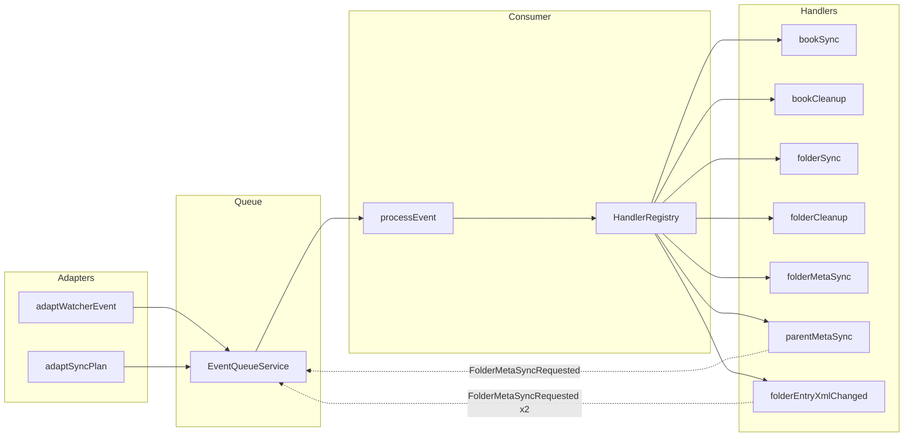
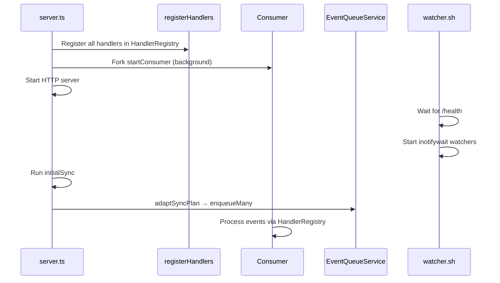

# Event-Driven Architecture

## Overview

The system uses native Linux `inotifywait` to watch two directories:

- `/books` — source files (books and folders)
- `/data` — generated metadata (entry.xml, feed.xml, covers)

Events are sent via HTTP to the server's EffectTS queue for sequential processing.

## Layered Architecture

```
┌─────────────────────────────────────────────────────────────┐
│ ADAPTERS LAYER (входные порты)                              │
├─────────────────────────────────────────────────────────────┤
│ adaptWatcherEvent         │ adaptSyncPlan                   │
│ - HTTP POST /events       │ - scanFiles + createSyncPlan    │
│ - raw → EventType         │ - files → EventType[]           │
│ - TTL deduplication       │ - no deduplication              │
└────────────┬──────────────┴───────────────┬─────────────────┘
             │                              │
             ▼                              ▼
┌─────────────────────────────────────────────────────────────┐
│ QUEUE LAYER (транспорт)                                     │
├─────────────────────────────────────────────────────────────┤
│ EventQueueService (DI)                                      │
│ - enqueue(event: EventType)                                 │
│ - Queue<EventType> (typed, not raw!)                        │
│ - consumer получает через DI                                │
└─────────────────────────┬───────────────────────────────────┘
                          │
                          ▼
┌─────────────────────────────────────────────────────────────┐
│ CONSUMER LAYER (маршрутизация)                              │
├─────────────────────────────────────────────────────────────┤
│ processEvent + startConsumer                                │
│ - HandlerRegistry.get(event._tag) — DI, NOT imports         │
│ - cascading events → queue.enqueueMany()                    │
│ - error = no cascades, log, continue                        │
└─────────────────────────┬───────────────────────────────────┘
                          │
                          ▼
┌─────────────────────────────────────────────────────────────┐
│ HANDLERS LAYER (бизнес-логика)                              │
├─────────────────────────────────────────────────────────────┤
│ bookSync, folderSync, folderMetaSync...                     │
│ - (event: EventType) => Effect<EventType[]>                 │
│ - return cascading events, NOT direct handler calls         │
│ - DI for ConfigService, LoggerService, FileSystemService    │
└─────────────────────────────────────────────────────────────┘
```

## DI Services

| Service                | Purpose                                              |
| ---------------------- | ---------------------------------------------------- |
| `ConfigService`        | filesPath, dataPath, baseUrl, port                   |
| `LoggerService`        | info, warn, error, debug                             |
| `FileSystemService`    | mkdir, rm, readdir, stat, atomicWrite                |
| `DeduplicationService` | TTL-based (500ms window) event filtering             |
| `EventQueueService`    | enqueue, enqueueMany, size, take                     |
| `HandlerRegistry`      | Map<tag, handler> — decouples consumer from handlers |
| `ErrorLogService`      | JSONL error logging to /data/errors.jsonl            |

## Event Types

```typescript
type EventType =
  | { _tag: "BookCreated"; parent: string; name: string }
  | { _tag: "BookDeleted"; parent: string; name: string }
  | { _tag: "FolderCreated"; parent: string; name: string }
  | { _tag: "FolderDeleted"; parent: string; name: string }
  | { _tag: "EntryXmlChanged"; parent: string }
  | { _tag: "FolderEntryXmlChanged"; parent: string }
  | { _tag: "FolderMetaSyncRequested"; path: string }  // cascading event
  | { _tag: "Ignored" };
```

## Cascading Events

Handlers return `EventType[]` instead of calling other handlers directly:

```typescript
// parent-meta-sync.ts
export const parentMetaSync = (event: EventType) =>
  Effect.gen(function* () {
    if (event._tag !== "EntryXmlChanged") return [];
    // ... compute parentDataDir
    return [{ _tag: "FolderMetaSyncRequested", path: parentDataDir }];
  });
```

Consumer enqueues returned events to queue end (FIFO):

```typescript
// consumer.ts
const result = yield* handler(event);
if (result.cascades.length > 0) {
  yield* queue.enqueueMany(result.cascades);
}
```

## Event Flow



## Handlers Reference

| Handler                       | Trigger                 | Returns                        |
| ----------------------------- | ----------------------- | ------------------------------ |
| `book-sync.ts`                | BookCreated             | `[]`                           |
| `book-cleanup.ts`             | BookDeleted             | `[FolderMetaSyncRequested]`    |
| `folder-sync.ts`              | FolderCreated           | `[]`                           |
| `folder-cleanup.ts`           | FolderDeleted           | `[FolderMetaSyncRequested]`\*  |
| `folder-meta-sync.ts`         | FolderMetaSyncRequested | `[]`                           |
| `parent-meta-sync.ts`         | EntryXmlChanged         | `[FolderMetaSyncRequested]`    |
| `folder-entry-xml-changed.ts` | FolderEntryXmlChanged   | `[FolderMetaSyncRequested x2]` |

\*folder-cleanup returns `[]` for root-level folders (no parent to update)

## Startup Sequence



## Artifact Structure

```
/data/
├── feed.xml                      # Root catalog feed
├── Fiction/
│   ├── _entry.xml                # Folder entry (for parent's feed.xml)
│   ├── feed.xml                  # Folder's feed (lists books + subfolders)
│   └── book.epub/
│       ├── entry.xml             # Book entry (for parent's feed.xml)
│       ├── cover.jpg             # Full-size cover
│       ├── thumb.jpg             # Thumbnail
│       └── file                  # Symlink → /books/Fiction/book.epub
└── Comics/
    ├── _entry.xml
    ├── feed.xml
    └── ...
```

## Loop Prevention

| Event        | Watched? | Reason                                  |
| ------------ | -------- | --------------------------------------- |
| `entry.xml`  | Yes      | Triggers parent feed regeneration       |
| `_entry.xml` | Yes      | Triggers own + parent feed regeneration |
| `feed.xml`   | No       | Would cause infinite loop               |
| `*.tmp`      | No       | Intermediate files                      |

## Testing

EffectTS DI enables easy unit testing with mock services:

```typescript
const TestLayer = Layer.mergeAll(
  TestConfigService,
  TestLoggerService,
  TestFileSystemService,
);

const event: EventType = { _tag: "BookDeleted", parent: "/test/books/", name: "book.epub" };
const effect = bookCleanup(event);
await Effect.runPromise(Effect.provide(effect, TestLayer));

expect(mockFs.rmCalls).toHaveLength(1);
```
