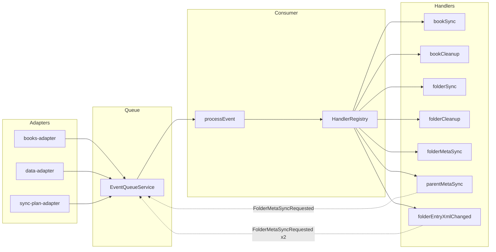
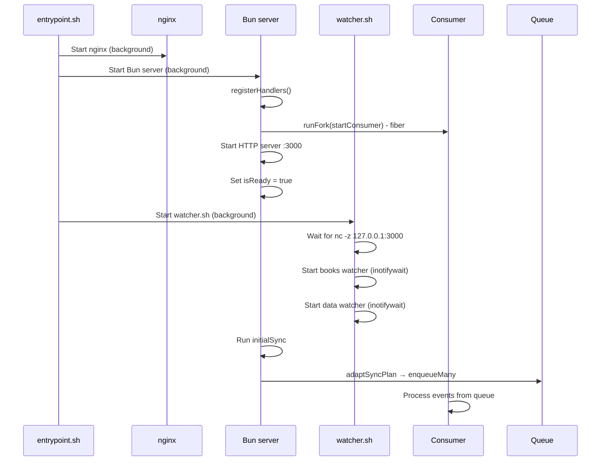

# Event-Driven Architecture

## Overview

The system uses native Linux `inotifywait` to watch two directories:

- `/books` — source files (books and folders)
- `/data` — generated metadata (entry.xml, feed.xml, covers)

Events are sent via HTTP to the server's EffectTS queue for sequential processing.

## Process Architecture

```
entrypoint.sh (PID 1)
├── nginx (background, :80 external)
│   ├── serves /data/* (OPDS XML, covers, books)
│   ├── serves /static/* (CSS, XSLT)
│   └── proxies /resync → Bun (with Basic Auth)
├── Bun server (background, 127.0.0.1:3000)
│   ├── POST /events/books ← books watcher
│   ├── POST /events/data ← data watcher
│   └── POST /resync
└── watcher.sh (background)
    ├── books watcher → wget → /events/books
    └── data watcher → wget → /events/data
```

## Dual Watcher System

Two independent inotifywait processes watch different directories:

### Books Watcher (/books)

- **Watches:** CREATE, CLOSE_WRITE, DELETE, MOVED_FROM, MOVED_TO
- **Endpoint:** POST /events/books
- **Adapter:** `books-adapter.ts`
- **Events:** BookCreated, BookDeleted, FolderCreated, FolderDeleted

### Data Watcher (/data)

- **Watches:** CLOSE_WRITE, MOVED_TO
- **Endpoint:** POST /events/data
- **Adapter:** `data-adapter.ts`
- **Events:** EntryXmlChanged, FolderEntryXmlChanged
- **Exclusions:** `events.jsonl`, `errors.jsonl`

### Why Two Watchers?

- Separation of concerns: source files vs generated artifacts
- Loop prevention: data changes trigger parent updates without recursive feed regeneration
- Different event sets: books need full lifecycle, data only needs completion events

## Layered Architecture

```
┌─────────────────────────────────────────────────────────────┐
│ ADAPTERS LAYER                                              │
├─────────────────────────────────────────────────────────────┤
│ books-adapter.ts       │ data-adapter.ts │ sync-plan-adapter│
│ - POST /events/books   │ - POST /events/ │ - scanFiles +    │
│ - raw → EventType      │   data          │   createSyncPlan │
│ - TTL deduplication    │ - entry.xml →   │ - no deduplication│
│ - CLOSE_WRITE →        │   EntryXml-     │                  │
│   BookCreated          │   Changed       │                  │
└────────────┬───────────┴────────┬────────┴────────┬─────────┘
             │                    │                 │
             ▼                    ▼                 ▼
┌─────────────────────────────────────────────────────────────┐
│ QUEUE LAYER                                                 │
├─────────────────────────────────────────────────────────────┤
│ EventQueueService (DI)                                      │
│ - enqueue(event: EventType)                                 │
│ - Queue<EventType> (typed, not raw!)                        │
│ - Single shared instance via ManagedRuntime                 │
└─────────────────────────┬───────────────────────────────────┘
                          │
                          ▼
┌─────────────────────────────────────────────────────────────┐
│ CONSUMER LAYER                                              │
├─────────────────────────────────────────────────────────────┤
│ processEvent + startConsumer                                │
│ - HandlerRegistry.get(event._tag) — DI, NOT imports         │
│ - cascading events → queue.enqueueMany()                    │
│ - error = no cascades, log, continue                        │
└─────────────────────────┬───────────────────────────────────┘
                          │
                          ▼
┌─────────────────────────────────────────────────────────────┐
│ HANDLERS LAYER (business logic)                             │
├─────────────────────────────────────────────────────────────┤
│ bookSync, folderSync, folderMetaSync...                     │
│ - (event: EventType) => Effect<EventType[]>                 │
│ - return cascading events, NOT direct handler calls         │
│ - DI for ConfigService, LoggerService, FileSystemService    │
└─────────────────────────────────────────────────────────────┘
```

## HTTP API

### Internal Endpoints (Bun server on 127.0.0.1:3000)

| Method | Endpoint      | Purpose                            | Schema        |
| ------ | ------------- | ---------------------------------- | ------------- |
| POST   | /events/books | Receive books watcher events       | RawBooksEvent |
| POST   | /events/data  | Receive data watcher events        | RawDataEvent  |
| POST   | /resync       | Trigger full resync (clears /data) | -             |

All endpoints return 503 if queue not ready, 202 on success, 400 on schema validation failure.

### Public Endpoints (nginx on :80)

| Path        | Behavior                                |
| ----------- | --------------------------------------- |
| `/`         | Redirect → `/feed.xml`                  |
| `/opds`     | Redirect → `/feed.xml`                  |
| `/static/*` | Serve from `/app/static/` (1 day cache) |
| `/resync`   | Auth → proxy to Bun (if ADMIN_USER set) |
| `/*`        | Serve from `/data/*`                    |

## Raw Event Schemas

Raw events from watcher.sh are validated using @effect/schema:

### RawBooksEvent

```typescript
{
  parent: string;  // "/books/Fiction/"
  name: string;    // "book.epub"
  events: string;  // "CREATE,ISDIR" or "CLOSE_WRITE"
}
```

### RawDataEvent

```typescript
{
  parent: string;  // "/data/Fiction/book.epub/"
  name: string;    // "entry.xml"
  events: string;  // "CLOSE_WRITE" or "MOVED_TO"
}
```

## Adapter Classification Logic

### Books Adapter (Effect.Match based)

- CREATE + ISDIR → FolderCreated
- CREATE (file) → Ignored (waits for CLOSE_WRITE)
- CLOSE_WRITE → BookCreated (if valid extension)
- DELETE + ISDIR → FolderDeleted
- DELETE (file) → BookDeleted (if valid extension)
- MOVED_FROM → Deleted (folder or book)
- MOVED_TO → Created (folder or book)
- Unknown → Ignored

### Data Adapter (Effect.Match based)

- entry.xml → EntryXmlChanged
- \_entry.xml → FolderEntryXmlChanged
- Other files → Ignored

### Deduplication

- TTL window: 500ms
- Cleanup threshold: 1000 entries
- Cleanup age: 5000ms
- Returns null if deduplicated, EventType if should process

## DI Services

| Service                | Purpose                                                |
| ---------------------- | ------------------------------------------------------ |
| `ConfigService`        | filesPath, dataPath, baseUrl, port                     |
| `LoggerService`        | info, warn, error, debug (structured JSON to stdout)   |
| `FileSystemService`    | mkdir, rm, readdir, stat, atomicWrite, symlink, unlink |
| `DeduplicationService` | TTL-based (500ms window) event filtering               |
| `EventQueueService`    | enqueue, enqueueMany, size, take                       |
| `HandlerRegistry`      | Map<tag, handler> — decouples consumer from handlers   |

## Event Types

```typescript
type EventType =
  | { _tag: "BookCreated"; parent: string; name: string }
  | { _tag: "BookDeleted"; parent: string; name: string }
  | { _tag: "FolderCreated"; parent: string; name: string }
  | { _tag: "FolderDeleted"; parent: string; name: string }
  | { _tag: "EntryXmlChanged"; parent: string }
  | { _tag: "FolderEntryXmlChanged"; parent: string }
  | { _tag: "FolderMetaSyncRequested"; path: string }  // cascading event
  | { _tag: "Ignored" };
```

## Cascading Events

Handlers return `EventType[]` instead of calling other handlers directly:

```typescript
// parent-meta-sync.ts
export const parentMetaSync = (event: EventType) =>
  Effect.gen(function* () {
    if (event._tag !== "EntryXmlChanged") return [];
    // ... compute parentDataDir
    return [{ _tag: "FolderMetaSyncRequested", path: parentDataDir }];
  });
```

Consumer enqueues returned events to queue end (FIFO):

```typescript
// consumer.ts
const result = yield* handler(event);
if (result.cascades.length > 0) {
  yield* queue.enqueueMany(result.cascades);
}
```

## Event Flow



## Handlers Reference

| Handler                       | Trigger                 | Returns                        |
| ----------------------------- | ----------------------- | ------------------------------ |
| `book-sync.ts`                | BookCreated             | `[]`                           |
| `book-cleanup.ts`             | BookDeleted             | `[FolderMetaSyncRequested]`    |
| `folder-sync.ts`              | FolderCreated           | `[FolderMetaSyncRequested]`    |
| `folder-cleanup.ts`           | FolderDeleted           | `[FolderMetaSyncRequested]`\*  |
| `folder-meta-sync.ts`         | FolderMetaSyncRequested | `[]`                           |
| `parent-meta-sync.ts`         | EntryXmlChanged         | `[FolderMetaSyncRequested]`    |
| `folder-entry-xml-changed.ts` | FolderEntryXmlChanged   | `[FolderMetaSyncRequested x2]` |

\*folder-cleanup returns `[]` for root-level folders (no parent to update)

## Startup Sequence



## Critical Pattern: ManagedRuntime

**NEVER use Effect.runPromise(Effect.provide()) repeatedly!**

Each `Effect.provide(LiveLayer)` creates NEW service instances, breaking shared state (queue, registry, deduplication).

```typescript
// ✅ CORRECT - shared runtime
const runtime = ManagedRuntime.make(LiveLayer);
await runtime.runPromise(handleBooksEvent(body));  // ← same queue
await runtime.runPromise(handleDataEvent(body));   // ← same queue

// ❌ WRONG - creates new queue each time
await Effect.runPromise(Effect.provide(handleBooksEvent(body), LiveLayer)); // queue #1
await Effect.runPromise(Effect.provide(handleDataEvent(body), LiveLayer));  // queue #2 ≠ queue #1
```

Used in server.ts for all HTTP handlers and initialSync.

## Structured Logging

### Log System (src/logging/)

- Flat JSON to stdout (Docker-friendly, no file-based logging)
- Log levels: debug, info, warn, error
- Controlled by LOG_LEVEL environment variable

### Event Tracing

Each event receives unique ID for full lifecycle tracking:

- `event_received` — adapter receives raw event
- `event_ignored` — filtered by adapter
- `event_deduplicated` — TTL cache hit
- `handler_start` — handler begins processing
- `handler_complete` — handler finishes successfully
- `handler_error` — handler fails
- `cascades_generated` — handler returns cascade events

### Log Format

```json
{"ts":"2026-01-07T10:00:00.000Z","level":"info","tag":"Consumer","msg":"Handler started","event_type":"handler_start","event_id":"BookCreated:/books/test.epub:1234567890:abc12","event_tag":"BookCreated","path":"/books/test.epub"}
```

## Artifact Structure

```
/data/
├── feed.xml                      # Root catalog feed
├── Fiction/
│   ├── _entry.xml                # Folder entry (for parent's feed.xml)
│   ├── feed.xml                  # Folder's feed (lists books + subfolders)
│   └── book.epub/
│       ├── entry.xml             # Book entry (for parent's feed.xml)
│       ├── cover.jpg             # Full-size cover (max 1400px)
│       ├── thumb.jpg             # Thumbnail (max 512px)
│       └── file                  # Symlink → /books/Fiction/book.epub
└── Comics/
    ├── _entry.xml
    ├── feed.xml
    └── ...
```

## Loop Prevention

| Event        | Watched? | Reason                                  |
| ------------ | -------- | --------------------------------------- |
| `entry.xml`  | Yes      | Triggers parent feed regeneration       |
| `_entry.xml` | Yes      | Triggers own + parent feed regeneration |
| `feed.xml`   | No       | Would cause infinite loop               |
| `*.tmp`      | No       | Intermediate atomic write files         |
| `*.jsonl`    | No       | Log files                               |

## nginx Integration

### Cache Headers

| File Type | Cache-Control                    |
| --------- | -------------------------------- |
| XML feeds | `no-cache` (always validate)     |
| Images    | `public, must-revalidate, 1 day` |
| Static    | `public, immutable, 1 day`       |

### Special Handling

- ETag support for all files
- Rate limiting for `/*/file` downloads (if RATE_LIMIT_MB set)
- 503 with `Retry-After: 5` if feed.xml missing (initializing)
- Basic Auth for /resync (if ADMIN_USER/ADMIN_TOKEN set)

## Resync Endpoint

POST /resync (proxied via nginx with Basic Auth):

1. Check isSyncing flag (409 if already syncing)
2. Set isSyncing = true
3. Clear /data directory contents (not directory itself)
4. Run same sync logic as initialSync
5. Effect.ensuring guarantees isSyncing = false on completion or error

Resync is fire-and-forget (returns 202 immediately), logs errors.

## Testing

EffectTS DI enables easy unit testing with mock services:

```typescript
const TestLayer = Layer.mergeAll(
  TestConfigService,
  TestLoggerService,
  TestFileSystemService,
);

const event: EventType = { _tag: "BookDeleted", parent: "/test/books/", name: "book.epub" };
const effect = bookCleanup(event);
await Effect.runPromise(Effect.provide(effect, TestLayer));

expect(mockFs.rmCalls).toHaveLength(1);
```
