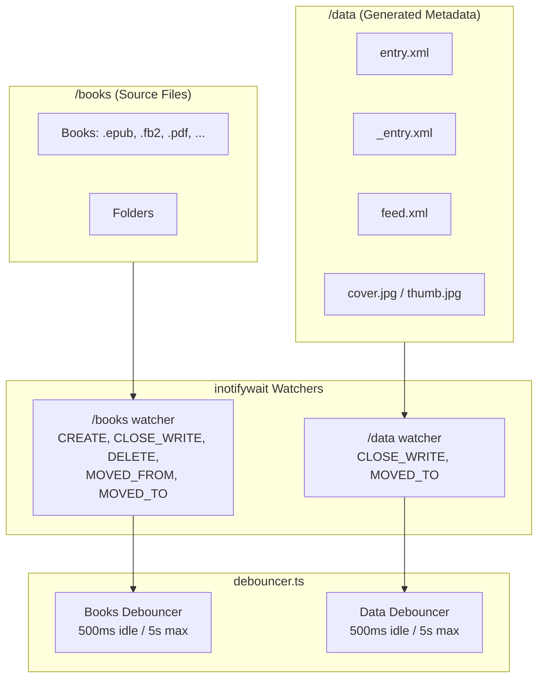
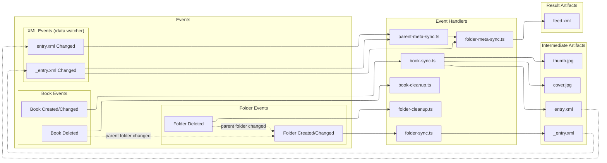
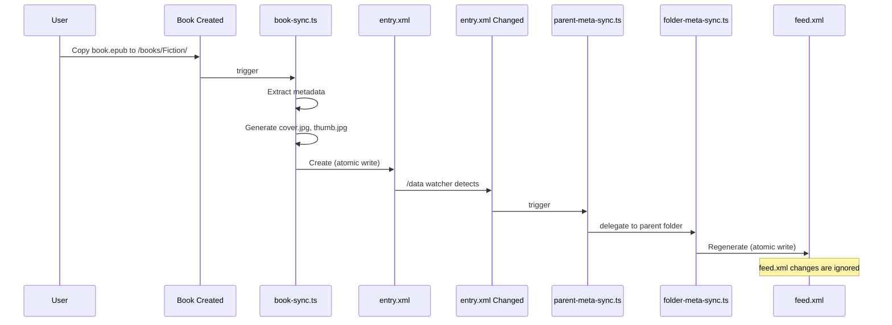
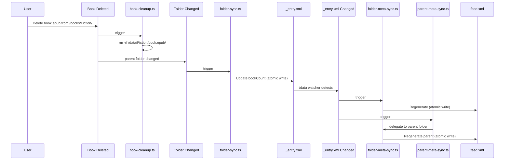
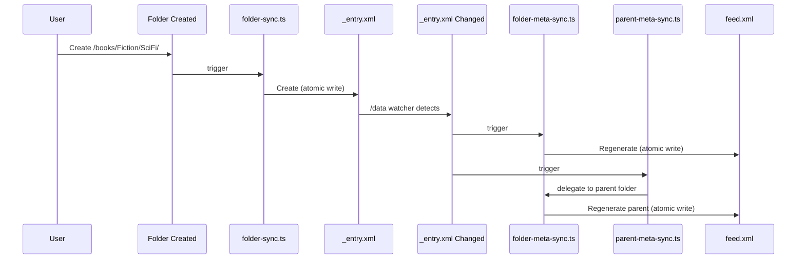
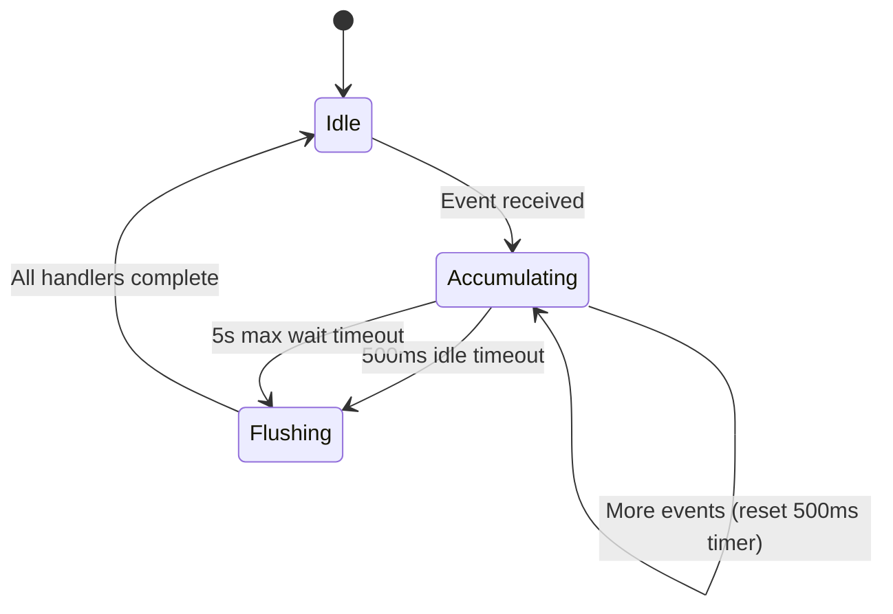
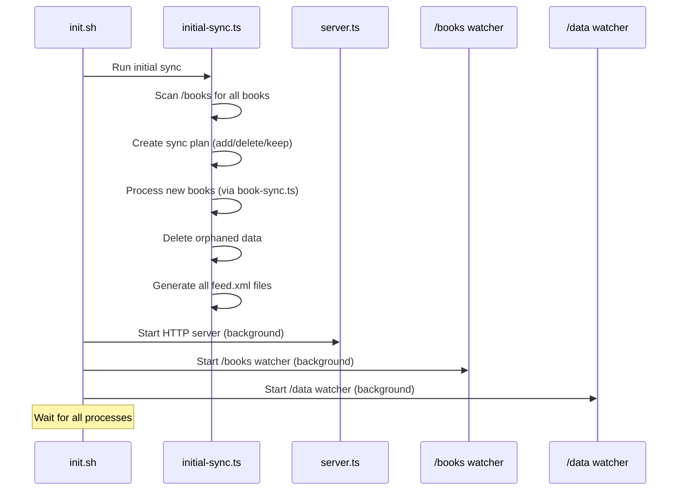

# Event-Driven Architecture Schema

## Overview

The system uses native Linux `inotifywait` to watch two directories:

- `/books` — source files (books and folders)
- `/data` — generated metadata (entry.xml, feed.xml, covers)

Events flow through a TypeScript debouncer that batches and routes them to appropriate handlers.

## System Architecture



## Event Flow



## Event Cascade Examples

### Adding a Book



### Deleting a Book



### Creating a Folder



## Handlers Reference

| Handler               | Trigger                           | Input                  | Output                                         | Notes                                  |
| --------------------- | --------------------------------- | ---------------------- | ---------------------------------------------- | -------------------------------------- |
| `book-sync.ts`        | Book CREATE/CLOSE_WRITE/MOVED_TO  | `/books/path/book.ext` | `entry.xml`, `cover.jpg`, `thumb.jpg`, symlink | Extracts metadata via format handlers  |
| `book-cleanup.ts`     | Book DELETE/MOVED_FROM            | `/books/path/book.ext` | Removes `/data/path/book.ext/`                 | Recursive delete                       |
| `folder-sync.ts`      | Folder CREATE/MOVED_TO (ISDIR)    | `/books/path/folder/`  | `_entry.xml`                                   | Counts subfolders and books            |
| `folder-cleanup.ts`   | Folder DELETE/MOVED_FROM (ISDIR)  | `/books/path/folder/`  | Removes `/data/path/folder/`                   | Recursive delete                       |
| `folder-meta-sync.ts` | `_entry.xml` CLOSE_WRITE/MOVED_TO | `/data/path/folder/`   | `feed.xml`                                     | Collects all entry.xml and \_entry.xml |
| `parent-meta-sync.ts` | `entry.xml` CLOSE_WRITE/MOVED_TO  | `/data/path/book/`     | Triggers `folder-meta-sync` for parent         | Delegation only                        |

## Artifact Structure

```
/data/
├── feed.xml                      # Root catalog feed
├── Fiction/
│   ├── _entry.xml                # Folder entry (for parent's feed.xml)
│   ├── feed.xml                  # Folder's feed (lists books + subfolders)
│   └── book.epub/
│       ├── entry.xml             # Book entry (for parent's feed.xml)
│       ├── cover.jpg             # Full-size cover
│       ├── thumb.jpg             # Thumbnail
│       └── file                  # Symlink → /books/Fiction/book.epub
└── Comics/
    ├── _entry.xml
    ├── feed.xml
    └── ...
```

## Debouncing Strategy



- **Idle timeout**: 500ms without new events triggers flush
- **Max wait**: 5 seconds maximum accumulation time
- **Batching**: Multiple events for same path are deduplicated (last event wins)

## Event Routing Logic

```typescript
// /books watcher routing
if (ISDIR flag) {
  DELETE/MOVED_FROM → folder-cleanup.ts
  CREATE/MOVED_TO   → folder-sync.ts
} else if (BOOK_EXTENSION) {
  DELETE/MOVED_FROM → book-cleanup.ts
  CREATE/CLOSE_WRITE/MOVED_TO → book-sync.ts
}

// /data watcher routing
if (name === "entry.xml") {
  → parent-meta-sync.ts
}
if (name === "_entry.xml") {
  → folder-meta-sync.ts
  → parent-meta-sync.ts (also)
}
// feed.xml events are ignored (loop prevention)
```

## Atomic Writes

All XML files use atomic write pattern to prevent partial reads:

```typescript
async function atomicWrite(path: string, content: string): Promise<void> {
  const tmpPath = `${path}.tmp`;
  await Bun.write(tmpPath, content);
  await rename(tmpPath, path); // Atomic on POSIX
}
```

This triggers `MOVED_TO` instead of `CLOSE_WRITE` in inotify.

## Loop Prevention

| Event        | Watched? | Reason                                  |
| ------------ | -------- | --------------------------------------- |
| `entry.xml`  | Yes      | Triggers parent feed regeneration       |
| `_entry.xml` | Yes      | Triggers own + parent feed regeneration |
| `feed.xml`   | No       | Would cause infinite loop               |
| `*.tmp`      | No       | Intermediate files                      |
| `cover.jpg`  | No       | No cascade needed                       |
| `thumb.jpg`  | No       | No cascade needed                       |

## Startup Sequence


