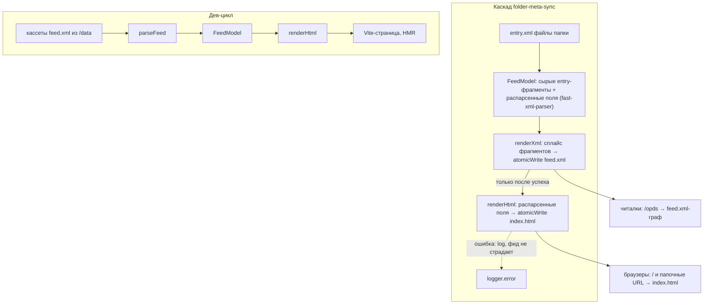

# Viewer Renderer Convergence - Plan

## Goal Capsule

- **Objective:** заменить браузерный XSLT-viewer единым источником данных (`FeedModel`) с двумя рендерерами — `renderXml` (feed.xml) и `renderHtml` (index.html на этапе синка), влить исходники opds-viewer в этот репозиторий и перестроить дев-плейграунд без React — до отключения XSLT в Chrome 158 (2026-11-17).
- **Product authority:** соло-мейнтейнер; Product Contract ниже — источник истины по поведению. Product Contract preservation: изменён по решению пользователя на планировании — R1 и Summary переведены с контракта `renderFeed(xml-строка)` на `FeedModel` + два рендерера; Outstanding Questions разрешены в Планинг-контракт (KTD); остальные R-IDs нетронуты.
- **Stop conditions:** остановиться и спросить, если (а) characterization-тест U1 показывает, что вывод feed.xml невозможно сохранить байт-в-байт (modulo `<updated>` — см. KTD-2) до флипа; (б) AE1 не выполняется ни на `:target`, ни на fallback-механизме; (в) смок читалок после флипа ломается.
- **Execution profile:** тесты только в docker (`bun run test`), сервер локально не запускать; дедлайн-тир (U1–U6, U8) до slippable-тира (U7, U9–U10).

---

## Product Contract

### Summary

Общая модель данных `FeedModel` становится единственным источником каталога: генератор собирает её один раз на папку и пишет два артефакта — `feed.xml` (`renderXml`, извлечённая текущая opds-ts-генерация) и `index.html` (`renderHtml`) — в существующем событийном каскаде. nginx отдаёт браузерам HTML, читалкам — фиды; плейграундом становится Vite-страница без React на реальных XML-кассетах (через адаптер `parseFeed`). Попап получает полные метаданные и закрывается кнопкой «назад»; layout.xsl, LayoutExample.tsx, react-cosmos и рантайм-зависимость от unpkg удаляются.

### Problem Frame

Разметка viewer'а существует в двух диалектах, синхронизируемых руками: JSX в отдельном репозитории opds-viewer (плейграунд на фикстурах-выдумках) и её XSLT-порт в `static/layout.xsl` (прод). CSS переносится копированием билд-артефакта и уже дрейфанул; `static/main.js` не имеет исходника нигде; реальные данные (кириллица, 200-элементные папки, отсутствующие обложки) впервые видны в проде. Поверх этого — жёсткий дедлайн: Chrome 158 (17 ноября 2026) отключает браузерный XSLT, официальный полифилл не воспроизводит `<?xml-stylesheet?>`-автотрансформацию, Firefox и WebKit поддержали удаление. Текущая архитектура перестаёт работать независимо от того, решим ли мы проблему дублирования.

### Key Decisions

- **HTML рендерится на этапе синка, а не в браузере.** Из двух проверенных пост-XSLT путей (sync-time HTML и Арчибальд-бутстрап в фиде) выбран первый: сохраняется работа без JS (браузерный XSLT давал её бесплатно; попапы уже CSS-driven), ошибки рендера всплывают в логах генератора, а не у пользователя, и /data остаётся простым файловым зеркалом, которое nginx отдаёт как есть. Третий вариант — рендер per-request живым Bun-сервером через nginx-proxy (убрал бы index.html-артефакты и правила R2/R16) — отвергнут за отход от ценностей «/data — статичное зеркало, nginx выживает без Bun».
- **Разводка аудиторий — структурой ссылок, без content-negotiation.** Читалки живут в графе явных `feed.xml`-ссылок (`rel="subsection"` уже указывает на `/comics/feed.xml`), браузеры — в графе папочных URL с `index.html`. Проверено спайком: две строки nginx. Фиды меняются в одном месте: из них уходит `<?xml-stylesheet?>`-инструкция — эквивалентность для читалок семантическая, не байтовая.
- **Улучшения вместо строгой парности с XSL.** Механического гейта DOM-эквивалентности не будет; приёмка — смок-проверка отрендеренных страниц плюс ручной чек-лист перед переключением прода. Дрейф JSX↔XSL уже сделал «эталон» неоднозначным.
- **Плейграунд — Vite-страница без React.** Рендерер — чистый TS; React-бандл и в старой схеме был мёртв в проде. react-cosmos уходит вместе с React; изолированные состояния заменяются набором XML-кассет.
- **Попап живёт в истории браузера.** «Назад» закрывает попап, а не уходит из папки. Кандидат-механизм — hash + `:target`; гейт выбора — AE1, поведенческая проба выполняется рано, в U6 (см. KTD-3).
- **main.js переписывается, не портируется.** Gridnav и фокус-ловушка завязаны на чекбокс-паттерн попапа, который уходит; tabbable/focus-trap становятся бандлируемыми зависимостями вместо рантайм-скриптов с unpkg. Клавиатурный слой — прогрессивное улучшение и НЕ стоит на критическом пути флипа (см. Priorities).
- **ui/ — обычный каталог, не workspace.** Единственный потребитель — этот репозиторий; второй package.json и workspace-механика в Docker-сборке — постоянная цена без выгоды.

### Requirements

**Рендеринг и раздача**

- R1. Общая модель `FeedModel` (папка, ссылки, записи с метаданными) и два рендерера от исходных данных: `renderXml(model)` — текущая feed.xml-генерация, извлечённая без изменения вывода; `renderHtml(model)` — полная HTML-страница: карточки папок и книг, breadcrumb по `rel="start"`/`self` (ветку `rel="up"` генератор не эмитит — мёртвый код XSL не переносится), обложки, форматы из MIME. Адаптер `parseFeed(xml) → FeedModel` для кассет и плейграунда.
- R2. Генератор пишет `index.html` рядом с `feed.xml` в том же событии каскада (folder-meta-sync), из той же модели. Порядок и изоляция: `index.html` рендерится после успешной записи `feed.xml`; ошибка рендера логируется и не препятствует записи фида; частичный `index.html` на диск не попадает (атомарная запись); `index.html` исключается из data-watcher-классификации — тот же инвариант, что у не-наблюдаемого `feed.xml`, иначе цикл событий.
- R3. nginx отдаёт браузерам HTML: `/` и папочные URL → `index.html`; `/opds` (302 → `/feed.xml`), сами `feed.xml`, скачивание книг, обложки — без изменений.
- R4. Базовый браузинг работает без JavaScript: список, навигация по папкам, открытие/закрытие попапа, скачивание.
- R5. Попап книги показывает полные метаданные: автор, описание, dc:subject/format/issued/language/isPartOf, кнопки скачивания по форматам. Отсутствующие поля опускаются без пустых строк; книга без обложки получает текстовый плейсхолдер (как в текущих карточках).
- R6. Кнопка «назад» при открытом попапе закрывает его и оставляет пользователя в текущей папке; повторный «назад» уходит из папки. Гарантируется при включённом JS; в no-JS-режиме попап открывается и закрывается (R4), но back-поведение не гарантируется (закрытие «#»-ссылкой оставляет запись в истории — принятое no-JS-поведение).
- R7. Клавиатурная 2D-навигация и фокус-ловушка попапа сохраняются как прогрессивное улучшение; tabbable/focus-trap бандлятся, рантайм-запросов к unpkg нет. Слой может приземлиться после флипа (см. Priorities).

**Дев-цикл**

- R8. Плейграунд — Vite-страница без React: выбор XML-фикстуры → живой вывод `renderHtml` с HMR по правке рендерера и CSS.
- R9. Скрипт собирает фикстуры-кассеты из реального `/data` (патологические случаи: кириллица, длинные заголовки, отсутствующие обложки, большие папки, глубокая вложенность); кассеты версионируются.
- R10. Дев-режим против живого docker: прокси на `:8080` с подменой статики из исходников. Опционален: при перегрузе скоупа режется первым — ценность сверх R8+R9 узкая; отказ от R10 не блокирует закрытие milestone.
- R11. Один командный вход собирает прод-артефакты viewer'а (CSS, main.js) в `static/`; ручного копирования между директориями нет. Свежесть артефактов проверяется автоматическим гейтом в тестовом наборе (см. KTD-4), а не процессом.

**Топология репозиториев**

- R12. opds-viewer вливается как каталог `ui/` существующего пакета (без workspace-механики — см. Key Decisions): один CLAUDE.md, один CI, один lockfile; после вливания старый репозиторий архивируется.
- R13. Удаляются: `static/layout.xsl`, `LayoutExample.tsx`, react-cosmos, React-зависимости, инжекция `<?xml-stylesheet?>` в фиды.

**Безопасность миграции**

- R14. Прод не зависит от браузерного XSLT до 2026-11-17.
- R15. Смок-тест в тестовом наборе: все папки тестовой библиотеки (включая большую папку и кириллицу) рендерятся в валидный HTML, внутренние ссылки (папки, обложки, скачивание) разрешаются; любая не отрендерившаяся папка — падение теста. Перед переключением прода — ручной чек-лист: браузинг, попап, back, скачивание — на Chromium, Gecko и WebKit/iOS Safari (десктоп и телефон).
- R16. Изменение рендерера/CSS/main.js приводит к перегенерации всех существующих `index.html` без нового кода: initial sync при старте контейнера эмитит события для всех папок безусловно, `POST /resync` стирает /data и перестраивает целиком — рестарт или resync после деплоя обновляет все страницы.

### Priorities

- **Дедлайн-гейт (до 2026-11-17):** R1–R6, R13–R16 — путь миграции; юниты **U1–U6, U8**. Срыв означает сломанный прод на Chrome 158.
- **Сдвигаемые без риска для прода:** R7–R12 — клавиатурный слой, качество дев-цикла, топология; юниты **U7, U9–U10**. Флип может уехать без клавонавигации (страница полноценна без JS); U7 возвращает её после флипа.

### Acceptance Examples

- AE1. **Covers R6.** Given попап книги открыт кликом по карточке, When пользователь нажимает «назад», Then попап закрыт, страница папки на месте, скролл не потерян.
- AE2. **Covers R3, R13.** Given OPDS-читалка настроена на `/opds`, When пользователь ходит по каталогу и скачивает книгу, Then поведение эквивалентно текущему; единственное изменение фида — удалённая `<?xml-stylesheet?>`-инструкция, которую читалки игнорируют (смок-прогон Moon+ Reader / FB Reader перед переключением).
- AE3. **Covers R4.** Given JavaScript отключён, When пользователь открывает `/`, заходит в папку, открывает попап и скачивает книгу, Then всё работает через стандартный Tab-порядок и клики; теряются только Gridnav-навигация и фокус-ловушка.
- AE4. **Covers R2.** Given книга добавлена в `/books`, When каскад отработал, Then в папке /data лежат `feed.xml` и `index.html`, отражающие добавленную книгу; при сбое между двумя записями фид первичен, следующее событие или reconcile выравнивает `index.html`.

### Scope Boundaries

- **Поиск** — явный follow-up после миграции (UI-заготовка есть в старом JSX; бэкенда под поиск нет и в этом скоупе не появится).
- **Читалка, настроенная на корневой URL `/`** — сейчас `/` отвечает 302 на feed.xml и такая настройка работает; после миграции корень отдаёт HTML. Каноничный вход для читалок — `/opds`; для этой инсталляции перенастройка — одна строка в приложении читалки.
- **Accept-redirect для старых браузерных закладок на feed.xml** — не делаем; прямой запрос feed.xml показывает сырой XML. Допущение: у solo-инсталляции таких закладок нет; появятся — лёгкий redirect как follow-up.
- **Редизайн UI за пределами попапа и back-поведения** — не в этом скоупе; вид карточек/сетки сохраняется (источник — тот же CSS; оттенки `random()`-вариаций карточек перетасуются при перегенерации — см. KTD-4).
- **Пиксельная эквивалентность с layout.xsl** — не цель; golden-diff-харнесс не строится.

### Dependencies / Assumptions

- **Толерантность читалок к изменению фида:** Moon+ Reader и FB Reader проверены смок-тестом 2026-07-14 на более инвазивном изменении (добавленный script-элемент в фиде); удаление PI строго безопаснее добавления элемента.
- **Фиды уже содержат метаданные для R5:** dc:issued/format/extent/subject, author, content, acquisition-ссылки — проверено на реальном `data/feed.xml`; попап не требует полей, которых нет в entry.xml.
- **Репозиторий приватен:** кассеты R9 содержат метаданные личной библиотеки; при публикации репозитория кассеты обезличиваются.
- **Контингенси по дедлайну:** go/no-go-чекпоинт **2026-10-01**, оценивает мейнтейнер; критерий — U1–U4 смержены и AE1-проба U6 пройдена. Если нет — активируется запасной путь: Арчибальд-бутстрап (спайк подтверждён: один инжект в фид + бандл рендерера; ценой потери no-JS).

### Sources

- Ideation с проверенными базисами: `docs/ideation/2026-07-14-viewer-dev-workflow-ideation.html` (6 идей, 2 подтверждены спайками).
- Спайк рендерера и nginx-разводки: `docs/ideation/render-spike.ts` — 8 index.html по /data, 2 строки nginx, роутинг-матрица зелёная.
- Спайк Арчибальд-бутстрапа (запасной путь): script-элемент в фиде рендерится Chromium, переваривается Moon+ Reader и FB Reader.
- Таймлайн удаления XSLT: [Chrome for Developers](https://developer.chrome.com/docs/web-platform/deprecating-xslt), [Chrome Platform Status](https://cr-status.appspot.com/feature/4709671889534976).
- Техника самотрансформации без XSLT: [Jake Archibald, 2025](https://jakearchibald.com/2025/making-xml-human-readable-without-xslt/).
- Несущие точки кода: `src/effect/handlers/folder-meta-sync.ts:126-150` (сборка фида — сплайсинг сырых entry-фрагментов в opds-ts-скелет, PI, atomicWrite, \_entry.xml, единый try/catch), `src/server.ts:51-53` (PI корневого фида), `src/server.ts:85-96` (/resync стирает /data целиком), `src/scanner.ts:158-161` (полный walk эмитит FolderCreated для всех папок безусловно), `src/effect/adapters/data-adapter.ts:8-10` (всё кроме entry.xml/\_entry.xml → Ignored), `src/watcher.sh:37-38` (regex исключений), `src/context.ts:91-94` (atomicWrite: tmp + rename), `src/constants.ts:7-11` (FEED_FILE и др.), `src/types.ts:16-31` (MIME_TYPES), `src/formats/utils.ts:3-10` (createXmlParser — паттерн для парсинга entry и parseFeed), `static/layout.xsl` (эталон поведения), `static/main.js` (Gridnav).

---

## Planning Contract

### Key Technical Decisions

- KTD-1. **FeedModel с двойным представлением записи + два сериализатора.** Запись модели несёт (а) verbatim entry-XML-фрагмент — `renderXml` сплайсит его без изменений в opds-ts-скелет, байт-сохранность структурная, не пересериализационная; (б) распарсенные метаданные (title, author, описание, dc:\*, ссылки) — единственный вход `renderHtml`. Парсинг фрагментов — при сборке модели в прод-каскаде, fast-xml-parser по паттерну `createXmlParser`. Файлы: `src/render/feed-model.ts`, `src/render/feed-xml.ts`, `src/render/feed-html.ts`, `src/render/parse-feed.ts` (кассеты/плейграунд → полная модель, фрагменты в ней = исходные entry из фида). Решение пользователя на планировании — заменяет исходный контракт «renderFeed(xml-строка)».
- KTD-2. **Извлечение renderXml — byte-preserving modulo `<updated>`, до флипа.** `<updated>`-таймстемпы (уровень фида и записей) — wall-clock и волатильны; модель несёт их как данные, часы инжектятся при сборке. Characterization-снапшоты гоняются с фиксированными часами; все before/after-дифы /data и критерий U8 «только PI-строка» определены modulo `<updated>`-строк. PI удаляется только в U8 (флип) — это разделяет риск «сломали фиды рефакторингом» и осознанное «убрали PI».
- KTD-3. **Попап: hash + `:target`, JS-улучшение поверх; проба — рано.** Открытие — переход на `#book-<id>`; CSS `:target` показывает попап без JS. Закрытие: при JS — `history.back()` (крестик и Esc); без JS — крестик-ссылка на `#` (reopen-on-back — принятое no-JS-поведение, зафиксировано в R6). Поведенческая AE1-проба (скролл, back, движки Chromium/Gecko/WebKit) выполняется на статичной спайк-странице в U6 — не в U7/U8. Если чистый `:target` теряет скролл — минимальный scroll-restore-скрипт входит в скоуп флипа U8, не ждёт полного U7. Полный fallback (JS-toggle + pushState) — только если и это не проходит.
- KTD-4. **Артефакты коммитятся в static/, Docker без build-стадии; свежесть — тестом.** `bun run build:ui` (Vite: CSS через существующий PostCSS-пайплайн; main.js — второй entry) пишет в `static/`; freshness-check `bun run build:ui && git diff --exit-code static/` — шаг `bun run test:all`, гейт U8 обеспечивает его без CI. Свойство пайплайна: seed `random()` — длина исходного CSS, поэтому любая правка CSS перетасовывает все `random()`-оттенки — ожидаемое поведение, не дефект сборки. Dockerfile продолжает `COPY static ./static`.
- KTD-5. **Перегенерация — существующими механизмами.** Initial sync эмитит FolderCreated для всех папок безусловно (scanner.ts:158-161) → каскад перезаписывает feed.xml+index.html при каждом старте контейнера; `POST /resync` стирает /data и перестраивает (server.ts:85-96). Нового кода под R16 нет.
- KTD-6. **Watcher-безопасность index.html двухслойная.** data-adapter уже классифицирует всё, кроме entry.xml/\_entry.xml, как Ignored (data-adapter.ts:8-10) — цикла не будет и без правок; regex в watcher.sh:37 расширяется (`|index\.html$`) только чтобы срезать шум событий.
- KTD-7. **Рендерер живёт в `src/render/`, ui/ — только дев-инструменты и исходники статики.** Модули `src/render/*` не импортируют Bun- и node:fs-API — файловый I/O остаётся в хендлерах; это держит их импортируемыми Vite-плейграундом. `ui/` (styles, gridnav, playground, postcss/vite конфиги) — dev-only, в Docker-образ не попадает.
- KTD-8. **nginx initializing: папочные URL и index.html входят в 503-ветку.** Для папочных URL — `try_files $uri $uri/index.html =404` (директория без index.html даёт 404, а не 403 index-модуля) плюс `error_page 403 = @check_initializing` как страховка; условие @check_initializing ловит `index.html` и trailing-slash-URI наравне с feed.xml. Покрывает оба состояния: /data пуст (initial build) и директория создана, но index.html ещё не записан (mid-cascade, после resync).

### High-Level Technical Design

Диаграмма — в Product Contract / Key Decisions (поток модели и двух рендереров). Направляющий эскиз, не спецификация: границы модулей и порядок записи — нормативные (R2, KTD-1), имена полей модели — на усмотрение реализации.

### Assumptions (plan-level)

- `_entry.xml`-генерация (folder-sync) не входит в FeedModel-рефакторинг — извлекается только сборка feed.xml: folder-meta-sync.ts:126-133 (это часть блока 126-150 из Sources; остаток блока — запись `_entry.xml` — НЕ извлекается) и server.ts:51-53.
- Кассеты для юнит-тестов рендерера снимаются с реального /data вручную в U2; скрипт `fixtures:pull` (U9) — автоматизация той же операции, не пререквизит U2.
- `files/test/` расширяется структурными кейсами (вложенная папка, папка только с книгами, пустая папка) в U1 — до характеризационных снапшотов; те же папки кормят смок R15.

---

## Implementation Units

### U1. FeedModel и извлечение renderXml (characterization)

- **Goal:** единая модель данных фида (двойное представление записей) и byte-preserving извлечение XML-генерации из хендлеров.
- **Requirements:** R1 (модель, renderXml), KTD-1, KTD-2.
- **Dependencies:** нет.
- **Files:** `src/render/feed-model.ts`, `src/render/feed-xml.ts` (новые); `src/effect/handlers/folder-meta-sync.ts`, `src/server.ts` (сборка фида заменяется вызовом); `files/test/` (новые структурные папки: вложенная, только-книги, пустая — пустая создаётся в test-setup); `test/unit/render/feed-xml.test.ts`, `test/integration/effect/cascade-flow.test.ts` (characterization).
- **Approach:** сначала расширить files/test структурными кейсами и зафиксировать снапшоты текущих feed.xml (с фиксированными часами — KTD-2) ДО рефакторинга; выделить модель: сырые entry-фрагменты + распарсенные поля (fast-xml-parser, паттерн createXmlParser) + `updated`-времена как данные; renderXml сплайсит фрагменты и включает PI (пока). Вывод обязан совпасть байт-в-байт modulo `<updated>`.
- **Execution note:** characterization first — снапшоты до первой правки хендлеров.
- **Test scenarios:** снапшот-равенство feed.xml (modulo `<updated>`) для корня, вложенной папки, папки только с книгами, пустой папки; `_entry.xml` не затронут; каскад cascade-flow зелёный без изменений ожиданий; распарсенные поля записи соответствуют фрагменту (title, author, dc:\*, ссылки).
- **Verification:** `bun run test` зелёный; diff сгенерированного /data до/после рефакторинга пуст modulo `<updated>`-строк.

### U2. renderHtml + parseFeed + кассеты (test-first)

- **Goal:** HTML-рендерер от модели и адаптер кассет.
- **Requirements:** R1 (renderHtml, parseFeed), R5 (частично — структура попапа появляется в U6).
- **Dependencies:** U1.
- **Files:** `src/render/feed-html.ts`, `src/render/parse-feed.ts` (новые); `test/unit/render/feed-html.test.ts`, `test/unit/render/parse-feed.test.ts`; `test/fixtures/feeds/*.xml` (кассеты: кириллица, длинные заголовки, без обложки, большая папка, глубокая вложенность — сняты с реального /data вручную).
- **Approach:** разметка зеркалит текущие BEM-классы (header, books-grid, card--folder/card--book) — прод-`style.css` ложится без правок (проверено спайком); ссылки папок — на папочные URL; формат из MIME по `types.ts` MIME_TYPES; breadcrumb по `rel="start"`/self. renderHtml потребляет только распарсенные поля модели (KTD-1); без Bun-API (KTD-7).
- **Execution note:** test-first на кассетах; roundtrip-тест parseFeed(renderXml(model)) ≡ model по полям, которые рендерит HTML (не по фрагментам).
- **Test scenarios:** happy path: папка с книгами и подпапками → все карточки, заголовок, breadcrumb; edge: пустая папка, запись без обложки (плейсхолдер), без автора, кириллический заголовок экранируется, `&`/`<` в описании экранируются; parseFeed: массивы из одного элемента (isArray), отсутствующие dc:\*-поля.
- **Verification:** юнит-тесты зелёные в docker; рендер каждой кассеты валиден (парсится DOM-парсером теста) и содержит ожидаемые карточки.

### U3. Каскад пишет index.html

- **Goal:** прод-генерация index.html в существующем событийном потоке.
- **Requirements:** R2, R16 (проверка), KTD-5, KTD-6.
- **Dependencies:** U1, U2.
- **Files:** `src/effect/handlers/folder-meta-sync.ts`, `src/server.ts` (корневой фид); `src/watcher.sh` (regex `|index\.html$`); `test/integration/effect/cascade-flow.test.ts`.
- **Approach:** после успешного atomicWrite feed.xml — renderHtml(model) в отдельном try/catch: ошибка → logger.error, результат хендлера не меняется; atomicWrite для index.html.
- **Test scenarios:** Covers AE4. Событие → оба файла на месте и согласованы; renderHtml бросает (искусственно битая модель) → feed.xml записан, ошибки в логе, хендлер вернул ok; index.html-событие от watcher'а → Ignored (явный кейс в тестах data-adapter); рестарт-перегенерация: повторный sync-план по неизменной библиотеке перезаписывает index.html (проверка R16).
- **Verification:** `bun run test`; в dev-стенде `docker compose up` создаёт index.html во всех папках /data без зацикливания watcher'а (лог чист от index.html-событий).

### U4. nginx: браузеры получают HTML

- **Goal:** роутинг-разводка аудиторий.
- **Requirements:** R3, KTD-8.
- **Dependencies:** U3.
- **Files:** `nginx.conf.template`; `test/e2e/nginx.test.ts`.
- **Approach:** `location = / { return 302 /index.html; }`; папочные URL — `try_files $uri $uri/index.html =404`; `error_page 403 = @check_initializing`; @check_initializing ловит index.html и trailing-slash-URI (KTD-8); `/opds`-блок не трогать.
- **Test scenarios:** Covers AE2 (роутинг-половина). e2e: `/` → 302 index.html; `/test/` → 200 text/html; `/test/feed.xml` → 200 text/xml; `/opds` → 302 feed.xml; скачивание книги — 200 + Content-Disposition; пустой /data: `/` и `/test/` → 503 с Retry-After; директория существует, index.html отсутствует → 503, не 403/404.
- **Verification:** `bun run test:e2e` зелёный.

### U5. Импорт ui-исходников, сверка CSS и build:ui

- **Goal:** исходники статики живут здесь; артефакты собираются одной командой; прод-CSS сверен с исходниками до перегенерации.
- **Requirements:** R11, R12 (перенос; архивация — U10), KTD-4, KTD-7.
- **Dependencies:** нет (параллелен U1–U4).
- **Files:** `ui/styles/*` (перенос из opds-viewer/src/styles), `ui/postcss.config.js`, `ui/vite.config.ts` (без React-плагина), `package.json` (скрипты `build:ui`, шаг freshness-check в `test:all`; devDeps: vite, postcss-пайплайн; без React/cosmos); `static/style.css` (перегенерирован после сверки).
- **Approach:** (1) сверка: rule-level diff текущего `static/style.css` против вывода пайплайна из перенесённых исходников; прод-правки, сделанные напрямую в static/style.css после последнего копирования, портируются в `ui/styles/*`; (2) перегенерация и визуальная проверка на спайк-странице/плейграунде до того, как U6 начнёт строить попап-стили; (3) freshness-check становится шагом `bun run test:all`.
- **Test scenarios:** Test expectation: none — конфигурация сборки; критерии в Verification.
- **Verification:** `bun run build:ui` детерминирован (повторный запуск — пустой diff); эквивалентность с текущим style.css проверена modulo `random()`-значений (seed = длина исходника, перетасовка оттенков ожидаема — KTD-4) и rule-level-дифф отревьюен; первый коммит перегенерации фиксирует новые оттенки; `bun run fix` и `npx knip` чистые.

### U6. Попап: полные метаданные + hash/:target + ранняя AE1-проба

- **Goal:** новый попап — R5-контент, back-закрытие, поведенческий гейт механизма.
- **Requirements:** R4, R5, R6, KTD-3. Гейт AE1.
- **Dependencies:** U2 (рендерер), U5 (стили).
- **Files:** `src/render/feed-html.ts`, `ui/styles/*` (попап-стили: `:target`-показ вместо чекбокса), `test/unit/render/feed-html.test.ts`.
- **Approach:** карточка ссылается на `#book-<slug>`; попап — элемент с этим id, `:target` показывает; крестик — ссылка на `#` (no-JS) / `history.back()` (JS-слой, U7 или мини-скрипт U8 — KTD-3). Все dc:\*-поля из модели; отсутствующие опускаются. AE1-проба: статичная отрендеренная страница, Chromium + Gecko + WebKit — back закрывает, скролл не теряется; результат пробы решает, нужен ли scroll-restore-мини-скрипт во флипе (KTD-3).
- **Test scenarios:** Covers AE1 (разметка + проба механизма; финальный ручной гейт — U8), AE3 (no-JS открытие/закрытие — разметка без JS-хуков). Попап содержит все заполненные поля и кнопки форматов; поля-пустышки не рендерятся; книга без обложки — плейсхолдер; два попапа на странице не конфликтуют id; переход попап→попап (`#book-1` → `#book-2` кликом по другой карточке при открытом попапе) показывает второй и скрывает первый.
- **Verification:** юнит-тесты; AE1-проба пройдена на трёх движках (или зафиксировано решение о scroll-restore-скрипте в U8).

### U7. main.js переписан: gridnav + фокус (пост-флип)

- **Goal:** клавиатурный слой поверх нового попапа, без unpkg. Slippable: НЕ блокирует флип U8.
- **Requirements:** R7, KTD-3 (JS-слой).
- **Dependencies:** U6.
- **Files:** `ui/gridnav/*.ts` (исходник), `package.json` (deps: tabbable, focus-trap; build:ui — второй entry → `static/main.js`), `src/render/feed-html.ts` (script-тег и data-атрибуты добавляются в этом юните; unpkg-теги не воспроизводятся).
- **Approach:** Gridnav на новых data-атрибутах: стрелки/WASD как сейчас; поведение на краях сетки — без wrap (стоп на границе); при открытом попапе стрелки неактивны (фокус в ловушке). Фокус: при открытии — на попап-контейнер (`tabindex="-1"`), при закрытии — возврат на карточку-триггер. Закрытие: Esc и крестик → `history.back()`. Восстановление скролла при hash-навигации, если AE1-проба U6 показала потерю. Прогрессивное улучшение — страница полноценна без main.js.
- **Test scenarios:** Test expectation: интерактив вне юнит-охвата — ручной гейт: стрелочная навигация по сетке, стоп на краях, Tab-ловушка в попапе, фокус-возврат на карточку, Esc/back закрывают, скролл сохраняется (AE1); отсутствие сетевых запросов к unpkg в DevTools.
- **Verification:** `bun run build:ui` собирает main.js; ручной прогон чек-листа на dev-стенде.

### U8. Флип прода и уборка

- **Goal:** прод без XSLT; R13/R14/R15 закрыты.
- **Requirements:** R13, R14, R15, R16, AE2.
- **Dependencies:** U3, U4, U6.
- **Files:** `src/render/feed-xml.ts` (PI удаляется), `static/layout.xsl` (удаляется), `test/integration/**` (смок R15), обновление снапшотов U1 (осознанное: минус PI-строка), при необходимости — scroll-restore-мини-скрипт (решение AE1-пробы U6, KTD-3).
- **Approach:** порядок: смок-тест R15 в наборе → удалить PI из renderXml (обновить characterization-снапшоты — диф ровно одна PI-строка, modulo `<updated>`) → удалить layout.xsl → рестарт стенда (KTD-5 перегенерация) → ручной чек-лист (без клавиатурного слоя, если U7 ещё не приземлился) + смок читалок (Moon+, FB) → деплой. Если старый main.js несовместим с новой разметкой — script-тег не эмитится до U7.
- **Test scenarios:** Covers AE2, AE4. Смок R15: каждая папка files/test рендерится, все внутренние href разрешаются в существующие файлы/папки; feed.xml-диф после флипа — только PI-строка (modulo `<updated>`); e2e-набор зелёный целиком; freshness-check артефактов в test:all зелёный.
- **Verification:** `bun run test:all` зелёный; ручной чек-лист (R15: Chromium/Gecko/WebKit, десктоп и телефон) пройден; читалки ходят и качают.

### U9. Плейграунд и fixtures:pull

- **Goal:** дев-цикл: Vite-страница + кассеты по команде.
- **Requirements:** R8, R9, R10.
- **Dependencies:** U2, U5.
- **Files:** `ui/playground/index.html`, `ui/playground/main.ts` (список кассет → parseFeed → renderHtml → innerHTML, HMR), `ui/scripts/fixtures-pull.ts` (`bun run fixtures:pull`: обход /data, отбор патологических случаев, запись в `test/fixtures/feeds/`), `package.json` (скрипты `dev:ui`, `fixtures:pull`); vite-proxy на :8080 (R10 — отдельный, режется без последствий для остального юнита).
- **Approach:** плейграунд импортирует `src/render/*` напрямую (KTD-7 гарантирует отсутствие Bun-API) — HMR по правке рендерера и стилей бесплатно.
- **Test scenarios:** Test expectation: none — дев-инструмент; критерий — ручной: правка feed-html.ts видна в браузере <1 с, кассеты открываются, fixtures:pull идемпотентен.
- **Verification:** `bun run dev:ui` работает без docker; `npx knip` не ругается на ui/.

### U10. Консолидация и документация

- **Goal:** одна кодовая база, актуальные доки.
- **Requirements:** R12 (завершение).
- **Dependencies:** U5, U8, U9.
- **Files:** `CLAUDE.md` (структура, команды build:ui/dev:ui/fixtures:pull, гайд «как менять шаблон»), `README.md`; архивация репозитория opds-viewer (GitHub archive — вне этого репо, шаг чек-листа).
- **Approach:** CLAUDE.md — единственный источник контекста: обновить разделы Project Structure, Quick Reference, Troubleshooting (убрать XSLT-ловушки, добавить index.html-инварианты).
- **Test scenarios:** Test expectation: none — документация.
- **Verification:** `bun run fix` чистый; CLAUDE.md не содержит упоминаний layout.xsl/cosmos как живых механизмов.

---

## Verification Contract

| Гейт                                              | Команда                                                                                                                 | Применимость            |
| ------------------------------------------------- | ----------------------------------------------------------------------------------------------------------------------- | ----------------------- |
| Юнит + интеграция (docker)                        | `bun run test`                                                                                                          | каждый юнит; 0 fail     |
| E2e nginx + события                               | `bun run test:e2e`                                                                                                      | U4, U8                  |
| Полный набор (включая freshness-check артефактов) | `bun run test:all`                                                                                                      | U8 (перед флипом)       |
| Линт/формат                                       | `bun run fix`                                                                                                           | каждый юнит; 0 warnings |
| Мёртвый код/зависимости                           | `npx knip`                                                                                                              | U5, U9, U10             |
| Свежесть артефактов (отдельно)                    | `bun run build:ui && git diff --exit-code static/`                                                                      | U5, U7, U8              |
| Ручной гейт AE1/R15                               | чек-лист: браузинг, попап, back, скролл, скачивание — Chromium, Gecko, WebKit/iOS Safari; смок Moon+ Reader и FB Reader | U6 (проба), U7, U8      |

Покрытие Acceptance Examples по юнитам:

| AE                                      | Юниты                                                                                       |
| --------------------------------------- | ------------------------------------------------------------------------------------------- |
| AE1 (back закрывает попап, скролл цел)  | U6 (разметка + проба на 3 движках) → U8 (финальный ручной гейт) → U7 (фокус/Esc, пост-флип) |
| AE2 (читалки без изменений)             | U4 (роутинг) → U8 (PI-диф + смок читалок)                                                   |
| AE3 (no-JS браузинг)                    | U6 (разметка без JS-хуков) → U8 (ручной гейт)                                               |
| AE4 (feed.xml + index.html согласованы) | U3 (каскад + изоляция ошибок) → U8 (смок)                                                   |

Тесты — только в docker; при изменении зависимостей — `bun run rebuild:test`.

## Definition of Done

- Дедлайн-тир (U1–U6, U8) выполнен: прод отдаёт HTML без браузерного XSLT, layout.xsl и PI удалены — до 2026-11-17.
- Фиды для читалок изменены ровно на удалённую PI-строку (characterization-диф U8, modulo `<updated>`); смок читалок пройден.
- AE1–AE4 выполняются (AE1 — проба U6 + ручной гейт U8).
- `bun run test:all` — 0 fail (включая freshness-check артефактов); `bun run fix` — 0 warnings; `npx knip` чист.
- Рантайм-запросов к unpkg нет.
- Slippable-тир: U7 (клавиатурный слой) приземлён пост-флип; U9–U10 выполнены либо явно перенесены отдельным решением; отказ от R10 не блокирует закрытие.
- Уборка: чекбокс-попап-CSS, React/cosmos-остатки, мёртвые ветки XSL-эпохи удалены; CLAUDE.md отражает новую структуру; экспериментальный код спайков не живёт в src/.
