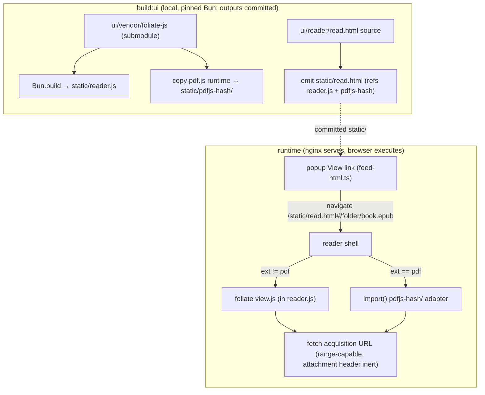

# In-Browser Reader Shell - Plan

## Goal Capsule

- **Objective:** let browser users read catalog books (EPUB and PDF first) in-page via one shared static reader, without touching download routing or the OPDS reader audience.
- **Product authority:** `docs/ideation/2026-07-14-pdf-epub-viewers-ideation.html` (idea 1, with ideas 2-4 folded in as requirements) plus the user's hands-on validation of foliate's PDF adapter on a complex PDF.
- **Stop conditions:** if U1's range check finds no `206` support, stop and surface it — the streaming assumption underpins the PDF story. If the U6 smoke pass shows the foliate PDF adapter failing on real catalog PDFs, stop and surface the pdf.js-display-layer fallback decision rather than shipping a broken PDF path. If the pdf.js worker turns out to require `'unsafe-eval'`, stop and surface it — do not widen the CSP (KTD-6).
- **Open blockers:** none.

---

## Product Contract

### Summary

Add a "View" action next to the existing download buttons that opens a single shared static reader page (`static/read.html`). One vendored runtime, foliate-js, renders EPUB and PDF (via its pdf.js adapter); book bytes stream from the existing acquisition URLs. Ships behind a per-format capability registry and a strict CSP.

### Problem Frame

The catalog's browser experience ends at a forced download: nginx serves every book with `Content-Disposition: attachment`, so clicking a book on a phone or laptop drops a file into Downloads instead of opening it. Users who just want to read a page or check a book must leave the browser for a separate reader app. Self-hosted comparables (Kavita) treat in-browser reading as the core experience; this catalog currently has none.

### Key Decisions

- **Single runtime: foliate-js, PDF included.** foliate-js (pinned git submodule, native ESM, MIT) covers EPUB/MOBI/AZW3/FB2/CBZ and PDF through its pdf.js adapter. The adapter is "proof-of-concept, highly experimental" per the authors, but it handled a complex PDF in a hands-on check; the direct pdf.js display layer is the named fallback if it regresses. No second reader library, no webpack.
- **One shared reader page, not per-book files.** A generated file per book would multiply watcher-safety surface and require full-catalog re-renders on every library upgrade. One committed `static/read.html` identified by the book URL keeps the sync cascade untouched.
- **Book bytes are never baked in.** `fetch()` ignores `Content-Disposition: attachment` (RFC 6266), so the reader consumes existing acquisition URLs as-is; nginx routing and the pinned attachment e2e test stay untouched. Base64-baking was rejected in ideation (33-37% inflation, data-URI ceilings, loses range streaming).
- **Full-page reader; the popup stays metadata-only.** The popup (a native `<dialog>` since the `:target` retirement — hash-driven, JS-required, platform focus containment) is tuned for a short-lived modal, not sustained reading.
- **v1 formats: EPUB and PDF.** The capability registry makes each additional foliate-supported format (fb2, cbz, mobi/azw3) a one-line enablement after its own smoke test.
- **CSP precedes EPUB rendering.** foliate's README: "Do NOT use this library without CSP" — iframe sandbox is defeatable (WebKit bug 218086), and the reader runs same-origin with Basic-Auth `/resync`.

### Requirements

**Entry point and catalog UI**

- R1. Each acquisition link whose format is marked viewable gets a "View" link rendered next to its download button in the book popup; formats not marked viewable show no View link.
- R2. Viewability is driven by a per-format capability registry co-located with `MIME_TYPES` in `src/types.ts`; enabling a format later is a registry change with no render-logic edits.
- R3. The v1 registry enables exactly `epub` and `pdf`.
- R4. The View link is a plain anchor to the reader URL — no click handlers; opening it navigates full-page, and browser Back returns to the folder page. (The `<dialog>` popup itself requires JS, so no-JS reachability of the View link is not a goal; R7 covers no-JS visitors who land on a reader URL directly.)

**Reader page**

- R5. One shared static reader page renders the book identified by its URL (acquisition path carried in the fragment — see KTD-1).
- R6. The reader renders reflowable formats paginated and PDF as fixed layout via foliate's `view.js`, with minimal v1 chrome: table of contents, prev/next, reading-position indicator, and actions to download the file and return to the catalog.
- R7. Without JS the reader page shows a fallback notice pointing back to the catalog's download buttons.

**Security**

- R8. The reader surface ships a deny-by-default CSP (`default-src 'none'`, widened only per the fixed directive set in KTD-6, never `'unsafe-eval'`); existing catalog and feed routes keep their current behavior.
- R9. EPUB scripted content stays disabled; the load-bearing control is the reader document's CSP inherited into foliate's `blob:` iframes, with the iframe sandbox as defense-in-depth (never `allow-scripts` together with `allow-same-origin`).
- R15. The reader shell validates the fragment before any fetch or link construction: same-origin only, no `javascript:`/`data:`/`blob:` schemes, no `..` segments, extension in the capability registry — a crafted reader URL can never trigger a request to `/resync` or any non-book path, and the derived back-link is never a dangerous scheme.

**Delivery and infrastructure verification**

- R10. An e2e test asserts `206 Partial Content` with `Content-Range` for a `Range` request against a real book file on the `/data` location block; streaming behavior is not relied on until this passes.
- R11. The existing e2e contract stays green: downloads keep `Content-Disposition: attachment`, OPDS feeds and no-JS browsing are unchanged.

**Build, assets, and dev loop**

- R12. foliate-js is vendored as a pinned git submodule and built by `build:ui` into committed `static/` assets covered by the existing freshness gate; a smoke fixture (one real EPUB, one complex PDF) in the playground exercises the runtime, and the PDF adapter must pass it before v1 ships.
- R13. pdf.js adapter assets (`pdf.mjs`, worker, `cmaps/`) live in their own hashed, immutable-cacheable asset directory and load only when a PDF opens; EPUB readers download none of them.
- R14. Viewer fetches pass through the existing `RATE_LIMIT_MB` throttle unchanged; v1 accepts this and documents it in the env-var table.

### Key Flows

- F1. Read a book
  - **Trigger:** user opens a book popup in the catalog and clicks View on an EPUB or PDF acquisition.
  - **Steps:** browser navigates to the reader URL; the shell reads the book path, lazy-loads the matching engine, fetches book bytes from the acquisition URL, renders; user pages through; Back or the close action returns to the folder page.
  - **Covers:** R1, R4, R5, R6.
- F2. Unsupported format
  - **Trigger:** user opens a popup for a djvu/cbr/txt book.
  - **Steps:** popup shows download buttons only; no View link appears.
  - **Covers:** R1, R2, R3.
- F3. No-JS visitor
  - **Trigger:** user with JS disabled opens a reader URL directly (saved/shared link; the `<dialog>` popup needs JS, so the View link is not reachable from the catalog without it).
  - **Steps:** reader page loads statically and shows the fallback notice with a path back to the catalog; browsing and downloads elsewhere are unaffected.
  - **Covers:** R4, R7, R11.

### Acceptance Examples

- AE1. **Covers R1-R3.** Given a folder with `book.epub`, `book.pdf`, and `book.djvu`, when its `index.html` is rendered, then the epub and pdf popups contain View links and the djvu popup contains none.
- AE2. **Covers R10.** Given a book file in `/data`, when a request carries `Range: bytes=0-1023`, then nginx responds `206` with a `Content-Range` header.
- AE3. **Covers R8, R9.** Given an EPUB containing scripted content (johnfactotum/epub-test), when it is opened in the reader in both a Chromium and a WebKit engine, then no book-supplied script executes — including inside the `blob:` iframe — and a CSP violation is the only observable effect.
- AE4. **Covers R11.** Given the full e2e suite, when the reader ships, then the existing download test still sees `Content-Disposition: attachment` on book GETs.
- AE5. **Covers R15.** Given reader URLs with hostile fragments (`#https://evil.example`, `#//evil.example`, `#javascript:alert(1)`, `#/../resync`, `#/%2e%2e%2fresync`), when the shell processes each, then it issues no network request and renders the error state with a safe back-link.
- AE6. **Covers R8.** Given EPUB fixtures exercising each CSP directive (`<object>`/`<embed>`, external ``/`<script src>`/`@font-face`, `<form action="/resync">`, `<base href>`, CSS `url()` exfil), when each opens in the reader, then every vector is blocked with no external request and no same-origin non-book request.

### Scope Boundaries

**Deferred for later**

- Reading progress persistence (localStorage keyed by entry id) — requires re-keying popup anchors from positional `book-${index}` to stable ids first; ideation idea 7.
- Search, annotations/highlights, TTS — foliate ships the modules; each is its own scoping exercise.
- Additional formats (fb2, cbz, mobi/azw3) — registry flips after per-format smoke tests.
- Sync-time previews and the zero-JS server-derived reading tier (ideation ideas 5-6).
- `?disposition=inline` variant for the browser's native PDF viewer.
- CSP for the rest of the catalog (index.html, feeds) — conscious deferral: the reader is where full attacker-controlled HTML executes; catalog pages render metadata through hono/html auto-escaping with `safeHref` scheme gating (contract pinned by `test/unit/render/escaping.test.ts`).

**Outside this product's identity**

- Cross-device reading sync, accounts, or any server-side reading state — the catalog stays a stateless static-file server.

### Dependencies / Assumptions

- foliate's PDF adapter generalizes beyond the one hand-validated complex PDF — checked by the U6 smoke fixture; fallback is the direct pdf.js display layer.
- nginx serves 206 range responses on the book location block — currently an inference from `sendfile on`; U1 verifies before anything relies on it.
- foliate-js API instability is absorbed by submodule pinning; upgrades are deliberate, diffed events.

### Sources / Research

- `docs/ideation/2026-07-14-pdf-epub-viewers-ideation.html` — ranked ideas, rejection table, verification findings.
- foliate-js README (github.com/johnfactotum/foliate-js) — format coverage, zip.js range-request loader, CSP caution, submodule guidance, `progress.js`/`search.js`/`overlayer.js`/`opds.js` modules; `reader.html` demo as reference implementation for the shell.
- `nginx.conf.template:72-81` — book location block with the attachment header; `:50-52` — why naive immutable caching failed before (unversioned URLs).
- `src/render/feed-html.ts:198-203` — `renderDownloads()`, the View-link insertion point; `formatFromMime()` in the same file is the MIME→format mapping; every href passes `safeHref`. `src/types.ts` — `MIME_TYPES` registry the capability map sits beside. Escaping contract: `test/unit/render/escaping.test.ts` + `test/fixtures/feeds/hostile.xml`.
- `test/e2e/nginx.test.ts:74-83` — pinned attachment contract (AE4 baseline).
- `.github/workflows/docker.yml` — CI runs `bun run build:ui:check` on a plain `actions/checkout@v4` (no submodules) with Bun pinned to 1.3.14 for byte-stable `Bun.build` output; `Dockerfile:14` copies committed `static/` (the image never needs the submodule).

---

## Planning Contract

**Product Contract preservation:** Outstanding Questions resolved below (KTD-1, KTD-3, KTD-5, U4 approach) and the section removed; R5 cites KTD-1 for the settled URL encoding. Security deepening strengthened R8/R9 (deny-by-default CSP, blob-iframe inheritance as the named control) and added R15, AE5, AE6 — clarifications of the brainstorm's security intent, no scope change.

**2026-07-15 revision (no scope change):** aligned with two landed refactors — hono/html auto-escape migration (`escapeHtml`/`escapeAttr` removed, `safeHref` + golden/purity gates `render:check`/`render:pure` added) and the native `<dialog>` popup (`:target` + focus-trap retired; popup now requires JS, F3/R4 reworded accordingly). KTD-1's hash precedent stands — hash remains the popup's source of truth.

### Key Technical Decisions

- KTD-1. **Reader URL is a fragment on the shared page: `/static/read.html#/<folder>/<file>`.** The fragment never reaches nginx, so no new location blocks, no interplay with the `@check_initializing` 503 guard, no URL-encoding surprises in routing, and the page URL stays one cacheable resource. Matches the repo's existing hash-based popup state precedent. Because the fragment is attacker-influenceable (a forged link), the shell validates before any fetch or link construction (R15): percent-decode once → resolve via `new URL(decoded, location.origin)` and require same origin → reject `javascript:`/`data:`/`blob:` schemes → normalize and reject any `..` segment → require a `VIEWABLE_FORMATS` extension and book-file path shape. Only then fetch; the back-to-catalog link derives from the validated path only.
- KTD-2. **Vendoring: git submodule at `ui/vendor/foliate-js`, pinned to a commit.** The foliate authors recommend exactly this (no releases, unstable API). Consequences handled explicitly: CI's `actions/checkout@v4` gains `submodules: true` in the `test` job only (the step that runs `build:ui:check`); the `build` job builds the Docker image from committed `static/` and never touches `ui/`, so it needs no submodule. Local dev needs `git submodule update --init` — documented in CLAUDE.md.
- KTD-3. **Build outputs: `static/read.html` + `static/reader.js` + `static/pdfjs-<hash>/`.** `build:ui` gains a reader step: bundle the shell (foliate's EPUB-family modules included) into `reader.js` via the existing pinned-Bun `Bun.build`; copy pdf.js runtime files (`pdf.mjs`, `pdf.worker.mjs`, `cmaps/`) into a directory named by a content/version hash; emit `read.html` referencing `reader.js` (no-cache, like `main.js`) and the hashed pdf.js path (immutable). Lockstep holds because `read.html` and the hash regenerate together in one `build:ui` run — the failure documented at `nginx.conf.template:50-52` (immutable + unversioned URLs) cannot recur. The build removes stale `static/pdfjs-*` directories before copying the current hash, and `build:ui:check` must fail on both tracked diffs and untracked files under `static/` so a newly generated hash directory cannot be omitted from the commit. All outputs are committed and covered by `build:ui:check`. The hash is cache-busting, not provenance: additionally record the upstream pdf.js version, source URL, and checksum in-repo (a `VENDOR.md` or lockfile-style note), pinned at or above the CVE-2024-4367 fix, so the vendored blob stays auditable.
- KTD-4. **pdf.js loads lazily at runtime, not bundled.** The shell dynamic-`import()`s the foliate pdf adapter (and its pdf.js dependency from the hashed directory) only when the fragment's extension is `pdf`. EPUB readers never fetch pdf.js bytes (R13). The EPUB-family engine can ship inside `reader.js` — it is small relative to pdf.js and always needed.
- KTD-5. **v1 smoke is a documented manual playground pass, not a browser-automation test.** The repo has no browser-test infrastructure; adding one is out of proportion for v1. U6 commits fixture books and a written checklist; e2e covers what HTTP-level tests can prove (headers, 206, artifact presence). Revisit automation when a second reader feature lands.
- KTD-6. **CSP is a pinned deny-by-default allowlist, not an empirically discovered set.** An "adjust until foliate/pdf.js works" approach converges on whatever works — which is exactly how `'unsafe-eval'` and an unset `default-src` (leaving `object-src`/`connect-src`/`base-uri`/`form-action` wide open) slip in. Baseline, delivered as an nginx response header on the reader document only (blob iframes inherit from it; never a `<meta>` tag):
  - `default-src 'none'`
  - `script-src 'self'` — never `'unsafe-eval'` or `'unsafe-inline'`; the reader HTML carries zero inline scripts/handlers
  - `object-src 'none'`; `base-uri 'none'`; `form-action 'none'`; `frame-ancestors 'self'`
  - `connect-src 'self'` (book-byte fetch; R15 guards shell-initiated same-origin requests before any fetch)
  - `worker-src 'self'` — the pdf.js worker is a real static file (KTD-3), so no `blob:` workers
  - `frame-src blob:`; `img-src blob: data:`; `style-src 'unsafe-inline' blob: data:` (`'unsafe-inline'` styles acceptable only because no external host is reachable anywhere in the policy; the shell must not require same-origin stylesheet fetches under this policy)
  - Configure pdf.js with `isEvalSupported: false`. If the worker demands `'unsafe-eval'` — stop condition, surface it, do not widen.
- KTD-7. **Registry shape: `VIEWABLE_FORMATS: ReadonlySet<string>` of extensions in `src/types.ts`,** next to `MIME_TYPES` (the repo's one-registry-many-consumers convention). `renderDownloads()` consults it through `formatFromMime()` (local to `feed-html.ts`); the reader shell consults the same set to reject non-viewable fragments (defense against hand-crafted URLs). Browser-purity constraint: both consumers are browser bundles — `feed-html.ts` is gated by `render:pure`, `reader.ts` is a browser entrypoint — so the module hosting the registry must stay free of Bun/node imports. `src/types.ts` qualifies today (zero imports); if it ever gains runtime imports, move the registry into `src/render/` instead of weakening the gate.

### High-Level Technical Design

Directional guidance, prose is authoritative: the build step runs locally and commits artifacts; nginx serves them statically; the shell picks the engine from the fragment's extension; both engines fetch bytes from the unchanged acquisition URL.

### Shell / foliate boundary

foliate owns everything inside the book — pagination, reading position, TOC layout, in-page swipe and zoom. Consume it as-is; do not re-specify it. foliate's README ships no keyboard shortcuts and treats its demo chrome as replaceable, so the boundary layer below is the shell's and nothing more.

- **Chrome wiring:** bind `ArrowLeft`/`ArrowRight` → `view.prev()`/`view.next()` and `Esc` → Return; render the TOC from `book.toc`, the position indicator from the `relocate` event, plus download and Return actions. Method binding, not UX design.
- **Return semantics:** Return is a real anchor to the validated containing folder URL (no popup hash), using browser history so browser Back also lands on folder browsing. The `<noscript>` R7 fallback is the same anchor.
- **Failure states (foliate has no opinion — the shell does the fetch):** fetch 404/503/network → "Couldn't load this book." + Return; invalid/hostile fragment → "This reader link is invalid." + Return; unrecognized extension reaching the shell (hand-crafted URL only — the catalog never emits one, per R1/AE1) → "This format isn't supported in the viewer." + Return. Never a blank page.
- **Focus:** on load, move focus to the book view or a skip-to-content link, not the address bar. The a11y floor stays light for v1 beyond that.
- **Not specified here — verified in the U6 smoke pass and recorded as known limitations:** mobile tap/zoom affordances and large-PDF loading latency.

### Assumptions

- Fragment-encoded book paths (KTD-1) are acceptable UX (no server-side reader URLs); revisit only if deep-linking through proxies that strip fragments becomes a real need.
- Manual smoke (KTD-5) is an accepted v1 verification level for in-browser rendering quality.
- Sample fixture books can be license-safe (public-domain EPUB, `epub-test`, a public-domain scanned PDF); if a "complex PDF" representative of the user's catalog cannot be committed, the checklist references a local-only file instead.
- `Bun.build` bundles foliate's ESM without transforms; if a foliate module resists bundling, falling back to copying foliate as-is into a hashed static dir (same pattern as pdf.js) is acceptable and stays within KTD-3's shape.

---

## Implementation Units

### U1. Prove range support and pin the byte-delivery contract

- **Goal:** verify the streaming assumption before any reader code exists.
- **Requirements:** R10, R11 (AE2, AE4).
- **Dependencies:** none.
- **Files:** `test/e2e/nginx.test.ts`.
- **Approach:** add an e2e case issuing `Range: bytes=0-1023` against an existing fixture book URL; assert `206`, `Content-Range`, and body length 1024. Keep the existing attachment assertion untouched as the AE4 guard.
- **Execution note:** test-first by definition; if nginx returns `200` instead of `206`, stop — surface the finding, do not patch nginx config inside this unit.
- **Test scenarios:**
  - Covers AE2. Range request on a book file returns `206` + `Content-Range` + correct byte count.
  - Covers AE4. Plain GET on the same file still carries `Content-Disposition: attachment`.
  - Open-ended range (`bytes=0-`) returns `206` or full `200` — record which, pdf.js handles both.
- **Verification:** `bun run test:e2e` green with the new cases.

### U2. Capability registry and View link in the popup

- **Goal:** the catalog offers View exactly where the reader can deliver (R1-R4).
- **Requirements:** R1, R2, R3, R4 (AE1, F2).
- **Dependencies:** none (links may 404 until U3/U4 land; acceptable within one branch — see Definition of Done).
- **Files:** `src/types.ts`, `src/render/feed-html.ts`, `ui/styles/index.css`, `test/unit/render/feed-html.test.ts` (or the existing renderer test file), regenerated `static/style.css`, regenerated `test/golden/*.html` (any feed-html markup change requires `bun run render:golden`).
- **Approach:** add `VIEWABLE_FORMATS` (KTD-7) with `epub`, `pdf`. In `renderDownloads()`, for each acquisition whose format is in the set, render a sibling `popup__view-btn` anchor to `/static/read.html#<encoded acquisition href>` — the href goes through `safeHref` like every other href/src (repo escaping contract), and interpolation stays inside `` frag` ` `` (never `.join()` fragments). Style it in the existing `.popup__downloads` flex row. Renderer stays pure TS (no Bun imports — `render:pure` gate).
- **Patterns to follow:** `formatFromMime()` and the acquisition map in `src/render/feed-html.ts`; one-registry convention of `MIME_TYPES`; hono/html auto-escape + `safeHref` discipline from the migration.
- **Test scenarios:**
  - Covers AE1. Model with epub+pdf+djvu entries renders View links only for epub and pdf.
  - View href correctly percent-encodes a path with spaces/unicode (fixtures exist with unicode names).
  - Registry flip (add `fb2` in test) turns the button on with no renderer edit.
  - Hostile acquisition href (extend `test/fixtures/feeds/hostile.xml` / `escaping.test.ts` if a viewable format appears there) yields a `safeHref`-gated View href, never a `javascript:`/`data:` fragment payload.
- **Execution note:** TDD — write the renderer tests first; run `bun run build:ui` and `bun run render:golden`, commit regenerated `static/` and `test/golden/` per repo rule.
- **Verification:** `bun run test` green; `bun run build:ui:check`, `bun run render:check`, `bun run render:pure` clean.

### U3. Vendor foliate-js and extend build:ui

- **Goal:** the reader runtime exists as committed, freshness-gated static artifacts (R12 build half, R13).
- **Requirements:** R12, R13.
- **Dependencies:** none.
- **Files:** `.gitmodules`, `ui/vendor/foliate-js` (submodule), `ui/scripts/build-ui.ts`, `ui/reader/read.html`, `.github/workflows/docker.yml`, `.oxlintrc.json` (oxlint ignore), `.prettierignore` (oxfmt ignore), generated `static/read.html`, `static/reader.js`, `static/pdfjs-<hash>/`; `knip.json` only if the new entrypoints trip unused-export detection.
- **Approach:** KTD-2, KTD-3, KTD-4. Before extending the build, run a minimal PDF adapter spike against foliate's reference/demo setup using the representative complex PDF; decide whether v1 continues with foliate's adapter or switches to the direct pdf.js display-layer fallback before U4/U5 depend on the choice. Add the submodule pinned to a reviewed commit. Extend `build-ui.ts` with a `buildReader()` step: bundle `ui/reader/reader.ts` (created in U4 — this unit lands it as a stub that boots and reports version), remove stale `static/pdfjs-*` directories, copy pdf.js runtime into `static/pdfjs-<hash>/` (hash from the pdf.js package version + file digest), emit `read.html` with both references. Add `submodules: true` to the `test` job's checkout step only (the `build` job needs no submodule). Exclude the new generated artifacts from both formatters exactly as `static/main.js` already is — two separate mechanisms: add `static/reader.js` and `static/pdfjs-*/**` to `.oxlintrc.json` `ignorePatterns` (oxlint, which currently lists only `static/main.js`) **and** to `.prettierignore` (oxfmt, which currently lists `static/main.js` + `static/style.css`); add `static/read.html` to `.prettierignore` too if oxfmt touches it. Missing either file lets a formatter pass rewrite an artifact and break the byte-exact `build:ui:check` gate.
- **Patterns to follow:** existing `buildCss`/`buildJs` structure in `ui/scripts/build-ui.ts`; the freshness-gate comment discipline (pinned Bun, no formatter passes on artifacts).
- **Test scenarios:** Test expectation: none — build scaffolding; proven by `build:ui:check` determinism (run twice, diff clean) and CI passing with submodule checkout.
- **Verification:** fresh clone + `git submodule update --init` + `bun run build:ui` reproduces committed `static/` byte-for-byte; `build:ui:check` catches both tracked static diffs and untracked generated files under `static/`; CI green.

### U4. Reader shell

- **Goal:** the shared reader page renders EPUB and PDF end-to-end (R5-R7).
- **Requirements:** R5, R6, R7 (F1, F3).
- **Dependencies:** U3.
- **Files:** `ui/reader/reader.ts`, `ui/reader/read.html`, `ui/reader/reader.css` (or a styles addition), regenerated `static/` artifacts, `test/unit/` for any pure helpers (fragment parsing, extension routing).
- **Approach:** validate the fragment per KTD-1's algorithm (R15) first; create `<foliate-view>`, `open()` the acquisition URL, render. Wire the shell boundary layer per the Shell / foliate boundary section (chrome binding, Return semantics, failure-state copy, focus) — everything inside the book is foliate's, consumed as-is. PDF path lazy-imports the adapter per KTD-4 with `isEvalSupported: false`. Pin the iframe posture: assert foliate's emitted `sandbox` tokens never combine `allow-scripts` with `allow-same-origin`. Use foliate's bundled `reader.html` demo as reference, not shipped code.
- **Patterns to follow:** progressive-enhancement layering of `ui/gridnav/main.ts`; theming via existing custom properties in `static/style.css`.
- **Test scenarios:**
  - Fragment parser happy path: `#/sci-fi/Dune.epub` → path + ext; encoded unicode names; missing/garbage fragment → error state; `.djvu` fragment → unsupported state.
  - Covers AE5. Hostile-fragment matrix, each asserting no fetch and a safe back-link: `#https://evil.example`, `#//evil.example`, backslash variant, `#javascript:alert(1)`, `#data:text/html,...`, `#/../resync`, `#/%2e%2e%2fresync`, double-encoded traversal.
  - Covers R15. No constructible fragment causes a request to `/resync` or any non-book path (a same-origin fetch would carry cached Basic-Auth credentials — a forged reader link must never become a credentialed resync).
  - Covers F1. (manual/smoke tier) EPUB opens, TOC navigates, position indicator moves, Back returns to folder.
  - Covers F1. Reader Return navigates to the clean containing folder URL; browser Back may restore the previous hash-popup history entry.
  - Covers R6. Each shell failure state (fetch error, invalid fragment, unrecognized extension) shows its defined copy + a working Return link — no blank page.
  - Covers R6. Arrow keys page (`view.prev()`/`view.next()`), Esc triggers Return, focus lands on the book view on load — the shell's chrome wiring, exercised in the U6 playground.
  - Covers F3/R7. With JS disabled the page shows the fallback notice (manual check, noscript is static).
  - Error tier: nonexistent book path shows the fetch-error state.
- **Execution note:** pure helpers (fragment parsing, routing) test-first in `bun test`; rendering behavior is exercised in the U6 playground pass.
- **Verification:** `bun run test` green; `bun run dev:ui` (or the U6 playground page) renders both fixture books; `build:ui:check` clean.

### U5. nginx: CSP for the reader, immutable cache for pdf.js assets

- **Goal:** reader surface locked down (R8, R9 header floor) and viewer assets cached correctly (R13 serving half).
- **Requirements:** R8, R9, R13, R11.
- **Dependencies:** U3 (asset directory naming).
- **Files:** `nginx.conf.template`, `test/e2e/nginx.test.ts`.
- **Approach:** exact-match location for `/static/read.html` adding the pinned KTD-6 policy (exact match beats the `^~ /static/` prefix — assert it isn't shadowed) **and re-declaring `add_header Cache-Control "no-cache"` in the same block** — nginx `add_header` replaces rather than inherits across matched locations, so the moment this block sets its own CSP header it drops the `no-cache` inherited from `^~ /static/`; without re-declaring it, `read.html` ships with no `Cache-Control` and the stale-asset bug KTD-3 guards against returns. Prefix location for `/static/pdfjs-` serving `Cache-Control: public, max-age=31536000, immutable` (safe because the name is content-hashed, KTD-3); all other `/static/` behavior unchanged (no-cache + ETag).
- **Patterns to follow:** existing location ordering in `nginx.conf.template` (regex book location wins first; keep new locations from shadowing it); the `:50-52` comment explains the caching history — extend it.
- **Test scenarios:**
  - `GET /static/read.html` carries the full KTD-6 policy (assert the exact directive string, so a drive-by widening fails the test) **and `Cache-Control: no-cache`** (guards the add_header-replace regression); `GET /index.html` and `GET /feed.xml` carry no CSP.
  - `GET /static/pdfjs-<hash>/pdf.mjs` carries the immutable Cache-Control; `GET /static/main.js` still no-cache.
  - Covers AE4/R11. Existing routing tests all stay green.
- **Verification:** `bun run test:e2e` green.

### U6. Playground fixtures and the smoke gate

- **Goal:** the R12 smoke pass and the AE3 security check are executable and documented.
- **Requirements:** R12, R8, R9 (AE3, AE6), backstops the foliate PDF adapter bet and the KTD-6 policy.
- **Dependencies:** U4, U5.
- **Files:** `ui/playground/` (reader preview page or extension of the existing playground), `test/fixtures/books/` or `ui/playground/fixtures/` (public-domain EPUB, complex PDF, `epub-test` scripted EPUB), `docs/plans/` untouched — the checklist lives in `ui/reader/SMOKE.md` (or CLAUDE.md section, implementer's call).
- **Approach:** wire fixtures into the playground so `bun run dev:ui` can open each in the shell; write the smoke checklist: EPUB pagination/TOC/position, complex-PDF rendering fidelity + first-page latency, scripted-EPUB with zero script execution **including inside the blob: iframe, in both a Chromium and a WebKit engine** (the sandbox-defeat foliate warns about is WebKit-specific), a CVE-2024-4367-style malicious-font PDF executing nothing, and the AE6 negative-content matrix (one small EPUB fixture per CSP directive: object/embed, external img/script/font, external font, form action, base href, same-origin `/resync` attempts via `img`/`srcset`/CSS `@import`/CSS `url()`, and external CSS `url()` exfil — each verified blocked via devtools/CSP reports). Mobile viewport pass. Record the pass in the PR description. The PDF smoke pass names the representative PDFs and records explicit thresholds for page rendering correctness, page navigation, first-page latency, and visible failure states; "acceptable" is not a pass condition without those thresholds.
- **Test scenarios:** Test expectation: none (automated) — this unit _is_ the manual verification tier per KTD-5; AE3's header half is automated in U5.
- **Execution note:** if the complex-PDF check fails, stop and surface the pdf.js display-layer fallback decision (Goal Capsule stop condition) — do not ship PDF half-working.
- **Verification:** checklist executed and recorded; both fixture books open in the playground and against the docker dev server; PDF thresholds recorded as pass/fail rather than subjective notes.

### U7. Documentation

- **Goal:** the feature is operable and maintainable from the docs (R14; CLAUDE.md mandate).
- **Requirements:** R14.
- **Dependencies:** U3-U6 (documents what shipped).
- **Files:** `CLAUDE.md`, `README.md` (env table if it lives there).
- **Approach:** CLAUDE.md updates: project structure (`ui/reader/`, `ui/vendor/foliate-js`, new static artifacts), submodule init step in dev workflow, viewer gotchas (immutable pdfjs dir pattern, registry location, smoke checklist pointer), env table note that `RATE_LIMIT_MB` throttles reader fetches too (R14). Name foliate-js and pdf.js as security-sensitive dependencies with a bump-on-advisory expectation (submodule pinning exists for API stability _and_ security patching; the pdf.js provenance note from KTD-3 is the audit trail).
- **Test scenarios:** Test expectation: none — documentation.
- **Verification:** CLAUDE.md quick-reference and structure sections match the shipped tree; `bun run fix` clean.

---

## Verification Contract

| Gate                              | Command                       | Applies to                          |
| --------------------------------- | ----------------------------- | ----------------------------------- |
| Lint/format, zero warnings        | `bun run fix`                 | all units                           |
| Unit + integration tests (docker) | `bun run test`                | U1, U2, U4                          |
| E2E (nginx routing, headers, 206) | `bun run test:e2e`            | U1, U5                              |
| Static artifact freshness         | `bun run build:ui:check`      | U2, U3, U4                          |
| Golden renderer output            | `bun run render:check`        | U2 (any feed-html markup change)    |
| Render browser-purity             | `bun run render:pure`         | U2 (any `src/render` import change) |
| Unused exports/deps               | `npx knip`                    | U2, U3, U4                          |
| Full suite                        | `bun run test:all`            | pre-merge                           |
| Manual smoke checklist (KTD-5)    | `bun run dev:ui` + docker dev | U6 gate before ship                 |

Tests run in docker per repo rule; never commit with failing tests. CI additionally re-proves the freshness gate with pinned Bun 1.3.14 and the submodule checkout.

---

## Definition of Done

- All seven units landed; U1's 206 check passed (or the plan was consciously revised per the stop condition).
- `bun run test:all` green, including the new e2e cases (206, CSP header, immutable cache header, attachment regression).
- `bun run build:ui:check` clean on CI with submodule checkout — fresh clone reproduces committed `static/`.
- U6 smoke checklist executed and recorded: EPUB + complex PDF pass the named PDF thresholds; scripted EPUB executes nothing in Chromium and WebKit (AE3); negative-content CSP matrix all blocked, including same-origin `/resync` passive subresource attempts (AE6); malicious-font PDF executes nothing.
- Hostile-fragment matrix green (AE5); CSP header asserted verbatim in e2e.
- View links appear only for epub/pdf (AE1); djvu/cbr/txt popups unchanged.
- CLAUDE.md updated (structure, submodule step, gotchas, env note).
- No abandoned experimental code in the diff; knip clean.

---

## Deferred / Open Questions

### From 2026-07-15 document review

- **PDF v1 path:** Should v1 keep the foliate PDF adapter path, or should it ship EPUB in the reader shell plus a native inline-PDF View path and defer foliate/pdf.js-rendered PDFs until stronger smoke evidence exists? The current plan keeps foliate PDF in v1 but recognizes the adapter as experimental and already names native inline PDF as deferred scope.
