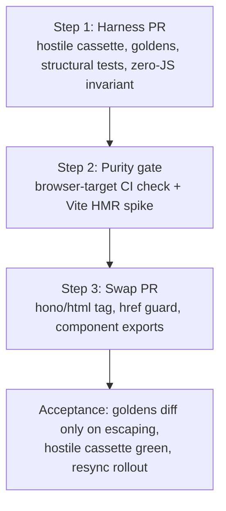
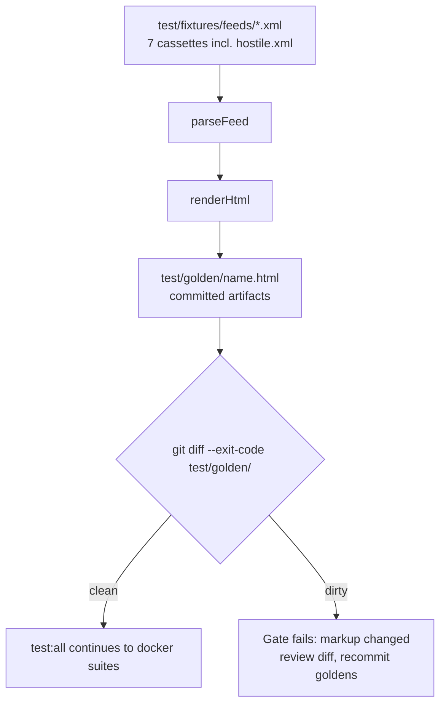

# Feed HTML Renderer Migration to hono/html - Plan

## Goal Capsule

- **Objective:** Replace manual escaping in `src/render/feed-html.ts` with hono/html's auto-escaping tagged template, landed behind a migration harness that makes the swap provable by one red/green run.
- **Product authority:** User decisions in the 2026-07-14 ideation session (`docs/ideation/2026-07-14-feed-html-templating-ideation.html`) and the confirmed scoping syntheses. Sequencing is user-fixed: harness → purity gate → swap.
- **Execution profile:** Work units in dependency order U1 → U2 → U3 → U4 → U5. U1 must capture goldens of the _current_ renderer before any unit changes markup. Tests run in docker (`bun run test`); the new `render:check` gate and `build:ui:check` run on the host.
- **Stop conditions:** Stop and surface if hono/html fails the purity gate or the Vite HMR spike (U4) — the fallback (hand-rolled tag vs uhtml-ssr) is a user decision, not an implementer choice. Stop if golden diffs at U5 contain non-escaping changes that can't be traced to a deliberate markup edit.
- **Open blockers:** None.

---

## Product Contract

### Summary

Migrate `src/render/feed-html.ts` from hand-rolled `escapeHtml`/`escapeAttr` string templates to hono/html's auto-escaping `html``` tag, in three sequenced steps: a render-safety harness (hostile-input cassette, committed golden HTML, structural test assertions), a mechanical browser-importability gate, then the swap itself with component functions exported.

### Problem Frame

Escaping in the renderer is opt-in at every interpolation: 15+ manual `escapeHtml`/`escapeAttr` calls across eight composition functions, where one forgotten call is a silent XSS hole. One gap already exists — `escapeAttr` (`src/render/feed-html.ts:7-9`) escapes `"` but never `'`, and ebook metadata is untrusted input from downloaded files. No test covers XSS attempts, double-escaping, or attribute edge cases. Meanwhile the existing unit tests assert exact byte sequences (`countOccurrences`, `indexOf` ordering) that break on harmless attribute reordering, so any renderer change today is judged by brittle checks that miss the property being changed.

### Key Decisions

- **hono/html over hand-rolled tag, uhtml-ssr, and @kitajs/html JSX.** Audited escape-by-default with `raw()` opt-out, isomorphic pure string ops, measured cost 1.5 kB → 764 B gzip with zero transitive dependencies. The convergence plan's no-library stance (KTD-1/KTD-7 in `docs/plans/2026-07-14-001-refactor-viewer-renderer-convergence-plan.md`) was migration-scoped and is lifted; its constraints (string output, no DOM at render time, browser-importable) remain binding.
- **Harness lands before any renderer change.** Goldens must capture pre-swap output so the swap's diff review is meaningful. The swap's acceptance is one run: goldens show only expected escaping diffs, hostile cassette passes, structural tests stay green.
- **Escaping-class diffs are the only acceptable golden diffs at the swap.** hono escapes `'` and `"` more strictly than the current code, so diffs like `'` → `&#39;` are expected and reviewed as intentional. The component-export refactor must be output-preserving so its changes never mix with escaping diffs.
- **URL scheme guarding is a separate rule, added at the swap step.** Auto-escaping neutralizes markup injection but not `javascript:` hrefs — no candidate library covers URL schemes. The renderer gets an explicit href scheme guard, asserted by the hostile cassette.
- **No `/rehtml` endpoint in this work.** After merge, existing `index.html` files in `/data` keep the old escaping until a restart or `POST /resync`; rollout is one full resync (user-accepted).



### Requirements

**Migration harness (step 1)**

- R1. A hand-authored hostile cassette joins the cassette set, probing: attribute breakout via `"` and `'`, event-handler injection (`" onmouseover=alert(1)`), `</script>` and `</style>` breakouts, double-escape inputs (`&amp;` in source data), newlines in attribute values, and `javascript:` URLs in every href-bearing field — acquisition href, folder subsection href, cover and thumbnail image sources.
- R2. Rendered output for the hostile cassette neutralizes every markup-injection probe: no live attributes or elements from data, and no double-escaping (`&amp;amp;` never appears for a single-escaped source).
- R3. A golden render gate commits the `renderHtml(parseFeed(cassette))` output for every cassette (hostile included) and fails CI when regenerated output differs, following the repo's existing commit-and-diff gate idiom; it is wired into the full test run.
- R4. Byte-exact unit assertions (`countOccurrences`, `indexOf` ordering) are replaced with parse-then-query structural assertions using fast-xml-parser, preserving each assertion's intent (element counts, class presence, id/href pairing, ordering).
- R5. A named zero-JS invariant test asserts rendered HTML never contains `on*=` attributes or inline script handlers; the popup remains CSS `:target`-only.

**Browser-importability gate (step 2)**

- R6. A CI check proves `src/render/*` is browser-importable — fails on node builtin imports (direct, or transitive via the browser-target build) and on `Bun.*` global usage.
- R7. The gate passes with hono/html imported, before the swap merges.
- R8. A short spike confirms hono/html works in the Vite playground (`bun run dev:ui`, HMR) before the swap merges.

**The swap (step 3)**

- R9. `escapeHtml`/`escapeAttr` and all manual escape call sites are replaced with hono/html's auto-escaping `html``` tag; unescaped interpolation is impossible by default, `raw()` marks the deliberate exceptions.
- R10. `renderHtml(model)` keeps its exact signature and returns a plain `string`; no async interpolations are introduced.
- R11. Href fields render inert for non-http(s)/relative schemes (`javascript:`, `data:`), asserted by the hostile cassette.
- R12. `renderCover`, `renderMeta`, and `renderDownloads` are exported as component functions; the export refactor itself is output-preserving (byte-identical goldens, AE5) — byte changes at the swap come only from the escaping mechanism, never from the export restructuring.
- R13. At the swap, golden diffs contain only escaping-class changes; structural tests and the zero-JS invariant pass unchanged.
- R14. KTD-1 holds: `renderHtml` consumes parsed `FeedModel` fields only, never XML fragments.
- R15. Dependency bookkeeping is clean: hono added to `package.json`, knip passes, `bun run fix` reports zero warnings and zero errors.

**Rollout**

- R16. Rollout completes with one full resync (or container restart) regenerating every `index.html` with the new escaping; no other rollout mechanism is added.

### Acceptance Examples

- AE1. **Covers R2, R9.** Given a book titled `Tom's "War" <b>bold</b>` — the card and popup show the title as literal text, attribute values contain `&#39;`/`&quot;`, and no `<b>` element appears in the output.
- AE2. **Covers R2.** Given a source title already containing `&amp;` — the rendered output contains `&amp;` exactly once for that ampersand, not `&amp;amp;`.
- AE3. **Covers R11.** Given `javascript:alert(1)` in an acquisition href, a folder subsection href, or a cover/thumbnail image source — the rendered attribute is inert (dropped or neutralized to `#`), and the hostile cassette test fails if a `javascript:` URL survives into any attribute at any of the four href interpolation sites.
- AE4. **Covers R5.** Given any cassette — the rendered HTML contains no `onclick`, `onmouseover`, or other `on*=` attributes; opening and closing the book popup works with JS disabled.
- AE5. **Covers R12, R13.** Given the component-export refactor alone (before the escaping swap in the same step is applied) — regenerated goldens are byte-identical to the committed ones.

### Scope Boundaries

- `POST /rehtml` standalone re-render endpoint — separate direction, stays in the ideation doc.
- JSX / `@kitajs/html` — rejected for this migration; revisit only if the viewer grows new page types.
- Popup rearchitecture (`<dialog>`, JSON-island hydration, sprae) — all break or must spike the zero-JS contract; out.
- CSS-class coherence gate (single source of class names) — golden diffs partially cover it; backlog.
- `toView` pre-escaped view objects — obsolete under auto-escaping.

### Dependencies and Assumptions

- Verified against the repo (2026-07-14 adversarial pass): the `escapeAttr` single-quote gap, the byte-exact test assertions, KTD-1/KTD-7 wording, the `build:ui:check` gate idiom, the playground import path.
- Assumption: hono/html escapes `'` and `"` in interpolated values (documented behavior; confirmed empirically by the hostile cassette before the swap merges).
- Assumption: the `hono/html` subpath import resolves under `moduleResolution: bundler` in both Bun and Vite (confirmed by R8 spike; bundle cost already measured at 764 B gzip).

### Sources

- `docs/ideation/2026-07-14-feed-html-templating-ideation.html` — ranked ideas, rejection table, and the adversarial verification this contract builds on.
- `docs/plans/2026-07-14-001-refactor-viewer-renderer-convergence-plan.md` — KTD-1 (dual representation) and KTD-7 (browser-importability), both still binding.
- Bundle measurement: `export { html } from "hono/html"` → 1.5 kB, 764 B gzip, zero transitive dependencies.
- Evidence dossiers (session-verified quotes with `file:line` pointers): `/tmp/compound-engineering/ce-ideate/7910d315/evidence-*.md` — temporary paths; the load-bearing facts are restated in this plan.

---

## Planning Contract

Product Contract preservation: unchanged.

### Key Technical Decisions

- KTD-1. **`render:check` is a host-side bun script mirroring `build:ui:check`.** `renderHtml(parseFeed(xml))` is pure TS with only fast-xml-parser — no docker dependencies — so the gate runs on the host and slots into `test:all` before the docker suites, exactly like the existing gate: `"render:check": "bun run render:golden && git diff --exit-code test/golden/"`. The check must also fail on **untracked** files under `test/golden/` (`git ls-files --others --exclude-standard test/golden/` prints nothing) — `git diff` alone ignores never-committed goldens, so a newly added cassette would otherwise bypass the gate silently. Goldens are byte-exact with no normalization: structural tests (R4) carry semantic assertions; goldens carry bytes, and their churn on intentional markup changes is the review feature.
- KTD-2. **Known-gap hostile assertions land as `test.todo`, activated at the swap.** The current renderer fails two hostile probes: the apostrophe **escaping contract** — `'` inside an attribute value must render as `&#39;`, and today it passes through raw (a latent hardening gap, not a live breakout: every current attribute is double-quoted, so `'` cannot terminate one; the byte-level assertion is what is red pre-swap and green post-swap) — and `javascript:` href neutralization. The harness PR must be green on the current code, so those two cases land as `test.todo` in U2 and flip to active tests in U5. Every other probe (double quotes, `</script>`, double-escape, newlines, `on*=`) asserts green from U2.
- KTD-3. **hono/html mechanics.** `import { html, raw } from "hono/html"` (subpath import; hono lands in `dependencies` — the renderer runs in the production image). Nested `html``` results are `HtmlEscapedString`and compose without re-escaping, so`raw()`should be rare or absent; the top-level return is coerced with`String(...)`to keep`renderHtml(model): string`. No async values are interpolated (an async interpolation turns the result into a Promise — forbidden by R10). **Composition rule:** never `.join()`nested`html```results —`Array.prototype.join`returns a primitive string without the escaped marker, and re-interpolating it double-escapes the whole fragment. Interpolate fragment arrays directly (hono flattens arrays of`HtmlEscapedString`without re-escaping) and preserve the existing`\n`-indent separators by interleaving them as literal strings, so golden diffs stay escaping-only. **Escaping-class diffs defined:** character-entity encoding changes only (`'`→`&#39;`, added `&quot;`) plus the neutralized-href rewrites of R11; attribute reordering, whitespace changes, or tag-boundary changes are not escaping-class and invalidate the swap diff (R13).
- KTD-4. **Href scheme guard is one helper applied at every href interpolation.** Allowlist: `http:`, `https:`, protocol-relative/relative paths, and `#` fragments; anything else renders as `#`. Lives in `src/render/feed-html.ts` (browser-importable, no deps).
- KTD-5. **Purity gate: `bun build --target=browser` wrapper script + a `Bun`-globals lint rule.** Primary: a script that builds the four `src/render/*.ts` modules with `--target=browser` and fails on error — covering direct and transitive imports. Bun APIs are globals, not imports, so neither the build nor an import-lint rule sees them: pair the gate with an oxlint `no-restricted-globals` rule for `Bun` scoped to `src/render/`. Implementation-time mutation tests: a temporary `node:fs` import and a temporary `Bun.file()` usage must each fail the combined gate. If bun silently shims node builtins for browser targets, fall back to an oxlint `no-restricted-imports` rule scoped to `src/render/` and keep the build step as a smoke check — that fallback covers direct imports only; transitive purity is then carried by the dependency audit (fast-xml-parser and hono have zero transitive dependencies).
- KTD-6. **`hostile.xml` is hand-authored and inherently safe from `fixtures:pull`.** The script writes only the five fixed filenames in its `selection` map, so hand-authored cassettes (`edge-cases.xml`, and now `hostile.xml`) are never overwritten — no code change needed; at most update its closing log message to name both. It lands in `test/fixtures/feeds/`, so the playground's `import.meta.glob` picks it up automatically — deliberate: visual inspection of hostile rendering is free.

### High-Level Technical Design

The render:check data flow (directional guidance, not implementation specification):



The three-step sequencing diagram lives in the Product Contract's Key Decisions.

---

## Implementation Units

### U1. Golden render gate (render:golden + render:check)

- **Goal:** Committed golden HTML for every cassette and a host-side freshness gate wired into `test:all`.
- **Requirements:** R3
- **Dependencies:** none
- **Files:** `ui/scripts/render-golden.ts` (new), `test/golden/*.html` (generated, committed), `package.json` (scripts `render:golden`, `render:check`; `test:all` gains `render:check` after `build:ui:check`)
- **Approach:** Script iterates `test/fixtures/feeds/*.xml`, runs `renderHtml(parseFeed(xml))`, writes `test/golden/<basename>.html`. `render:check` regenerates and diffs, mirroring `build:ui:check` (KTD-1). Deterministic by construction — the renderer has no timestamps or randomness.
- **Execution note:** Capture goldens of the current renderer before any other unit changes markup — this unit lands first.
- **Patterns to follow:** `ui/scripts/build-ui.ts` and the `build:ui:check` script line in `package.json`.
- **Test scenarios:**
  - Happy path: fresh goldens → `render:check` exits 0.
  - Failure path: edit any golden byte (or the renderer) → `render:check` exits non-zero.
  - Failure path: a new cassette without a committed golden → `render:check` exits non-zero (untracked-file check).
  - Determinism: two consecutive `render:golden` runs produce byte-identical files.
- **Verification:** `bun run render:check` passes locally; `bun run test:all` runs it before docker suites; goldens are committed and reviewable.

### U2. Hostile cassette + escaping contract tests

- **Goal:** Adversarial input corpus with an explicit escaping contract; known gaps recorded as `test.todo`; zero-JS invariant named.
- **Requirements:** R1, R2 (partial until U5), R5
- **Dependencies:** U1 (hostile golden joins the committed set)
- **Files:** `test/fixtures/feeds/hostile.xml` (new, hand-authored), `test/unit/render/escaping.test.ts` (new), `test/golden/hostile.html`
- **Approach:** Author a feed with probes in every interpolated field class: title, author, summary, subject, acquisition href/type, thumbnail href (KTD-6 covers fixtures-pull protection). Assertions parse the output and check: no `on*=` attributes anywhere (R5, named `zero-JS invariant`), no element in the output that originated from data text, single-escaping for pre-escaped sources. The apostrophe-attribute-breakout and `javascript:`-href cases land as `test.todo` (KTD-2).
- **Test scenarios:**
  - Covers AE2: source `&amp;` renders once-escaped.
  - Covers AE4: no `on*=` attribute in any cassette's output (loop over all 7).
  - `" onmouseover=alert(1)` in title → no `onmouseover` attribute in output.
  - `</script>` in summary → no `<script>` element boundary produced.
  - Newline in author → attribute values remain well-formed (cassette validation loop stays green).
  - `test.todo`: apostrophe escaping contract — `'` in an attribute value renders as `&#39;` (activates in U5).
  - `test.todo`: `javascript:` URLs neutralized at all four href interpolation sites — acquisition, folder href, cover, thumbnail (activates in U5).
- **Verification:** New test file green in docker (`bun run test`); `test.todo` entries visible in output; hostile.html golden committed; playground renders hostile.xml without breaking.

### U3. Structural test migration

- **Goal:** Replace byte-exact assertions with parse-then-query structural assertions so the swap is judged on structure, not bytes.
- **Requirements:** R4
- **Dependencies:** U1 (goldens now own byte-level protection)
- **Files:** `test/unit/render/feed-html.test.ts` (amended in place), `test/helpers/` (new parse-query helper, `XMLParser` with `preserveOrder: true`)
- **Approach:** Build a new parse-query helper in `test/helpers/` around `XMLParser` with `preserveOrder: true` — the existing cassette loop only calls `XMLValidator.validate`, which produces no tree to query, and document-order assertions need order preservation. Rewrite the byte-sensitive assertions — class-occurrence counts, `id="book-N"` uniqueness, `indexOf` document-order checks — as queries over the parsed tree. Keep text-content assertions (escaped-title checks) where they assert content, not byte layout. Preserve every test's intent; this unit changes assertions, never the renderer.
- **Test scenarios:**
  - Intent preservation: all 11 existing test intents still covered (folder/book card counts, root breadcrumb omission, no-cover fallback, popup id uniqueness and order, empty-section omission, script-bundle presence).
  - Sensitivity check (dev-time mutation): renaming `card--book` in the renderer fails the migrated tests; reordering two attributes in a tag does not.
- **Verification:** `bun run test` green; a deliberate attribute-reorder mutation in the renderer passes unit tests but fails `render:check` — confirming the byte/structure split of KTD-1.

### U4. Browser-purity gate + hono spike

- **Goal:** KTD-7 becomes a mechanical CI check; hono/html is proven importable in both toolchains before the swap.
- **Requirements:** R6, R7, R8
- **Dependencies:** U1 (gate joins `test:all` alongside `render:check`)
- **Files:** `ui/scripts/render-purity.ts` (new), `package.json` (script `render:pure` wired into `test:all`; `hono` added to `dependencies`)
- **Approach:** Per KTD-5: build `src/render/*.ts` with `--target=browser`, fail on error; add the `Bun`-globals lint rule; mutation-test the gate during implementation (a temporary `node:fs` import and a temporary `Bun.file()` usage must each fail it); fall back to scoped oxlint `no-restricted-imports` if bun shims silently. Add the hono dependency here and prove R7 with a lint-clean real usage: render the static `FAVICON_LINKS` fragment through `String(html``...``)` in `src/render/feed-html.ts` — output stays byte-identical (verified by `render:check`), oxlint sees a used import, knip sees a used dependency. Spike R8: run `bun run dev:ui`, load a cassette, confirm HMR works with the import present.
- **Execution note:** This is gate/config work; prefer runtime smoke verification (gate runs, spike loads) over unit coverage.
- **Test scenarios:** Test expectation: none — CI gate and spike; the gate itself is the test. Mutation check (node:fs import fails the gate) is performed and reverted during implementation, not committed.
- **Verification:** `bun run test:all` runs the purity gate; gate demonstrably fails on both the node-import and the Bun-global mutation; playground loads with hono imported; knip accepts the new dependency.

### U5. The swap: hono/html tag, href guard, component exports

- **Goal:** Auto-escaping by default in the renderer, href scheme guard, exported components, hostile contract fully active.
- **Requirements:** R2 (complete), R9, R10, R11, R12, R13, R14, R15
- **Dependencies:** U2, U3, U4
- **Files:** `src/render/feed-html.ts`, `test/unit/render/escaping.test.ts` (activate the two `test.todo` cases), `test/golden/*.html` (regenerated), `test/unit/render/feed-html.test.ts` (only if a structural assertion referenced escaping bytes)
- **Approach:** Replace `escapeHtml`/`escapeAttr` with `html```/nested-template composition per KTD-3; delete the two helper functions. Add the `safeHref`guard per KTD-4 and apply it at every href interpolation. Export`renderCover`/`renderMeta`/`renderDownloads`unchanged. Land in two reviewable moves inside the unit: component exports first (goldens byte-identical — AE5), then the escaping swap (goldens regenerate with escaping-only diffs — R13). Flip the two`test.todo` cases to active.
- **Execution note:** Regenerate goldens last and review the diff line-by-line: every changed line must be an escaping-class change (`'`→`&#39;`, added `&quot;`, neutralized href). Any other diff means the refactor leaked markup change — stop and fix before committing.
- **Patterns to follow:** hono/html usage per its docs (auto-escape, `HtmlEscapedString` passthrough); existing function shapes in `src/render/feed-html.ts` stay.
- **Test scenarios:**
  - Covers AE1: apostrophe/quote/element injection in title fully neutralized in text and attribute contexts.
  - Covers AE2: no double-escaping after the swap.
  - Covers AE3: `javascript:` URLs inert at all four href sites (activated todos).
  - Covers AE4: zero-JS invariant still green.
  - Covers AE5: component-export commit leaves goldens byte-identical.
  - Signature: `renderHtml` returns `typeof === "string"` (not an object or Promise).
  - Regression: all structural tests (U3) and the cassette well-formedness loop pass unchanged.
- **Verification:** `bun run test:all` fully green (render:check with regenerated goldens, purity gate, docker suites, e2e); `bun --bun tsc --noEmit` clean; `bun run fix` zero warnings; `npx knip` clean; golden diff reviewed as escaping-only.

---

## Verification Contract

| Gate               | Command                                   | Proves                                                                     |
| ------------------ | ----------------------------------------- | -------------------------------------------------------------------------- |
| Golden freshness   | `bun run render:check`                    | Committed goldens match the renderer (R3, R13)                             |
| Browser purity     | `bun run render:pure` (via `test:all`)    | `src/render/*` has no Bun/node imports (R6, R7)                            |
| Unit + integration | `bun run test` (docker)                   | Escaping contract, structural assertions, cassette well-formedness (R1-R5) |
| E2E                | `bun run test:e2e`                        | `index.html` serves correctly through nginx; card hrefs resolve            |
| Static freshness   | `bun run build:ui:check` (via `test:all`) | Unrelated `static/` artifacts untouched                                    |
| Types              | `bun --bun tsc --noEmit`                  | Signature preservation (R10)                                               |
| Lint/format        | `bun run fix`                             | Zero warnings, zero errors (R15)                                           |
| Dependency audit   | `npx knip`                                | hono accounted for, nothing unused (R15)                                   |

Full run: `bun run test:all` (after wiring `render:check` and `render:pure` into it in U1/U4).

---

## Definition of Done

- All 16 requirements satisfied; R16 (rollout resync) documented as the deploy step, not code.
- `bun run test:all` green with the two new gates wired in.
- No `test.todo` remains in `test/unit/render/escaping.test.ts` — both known-gap cases active and passing.
- Golden diff at the swap reviewed and escaping-only (R13); goldens committed.
- `CLAUDE.md` updated: new `render:check`/`render:pure` commands, hono dependency note, golden-regeneration workflow for future markup changes.
- No abandoned experiment code (scratch imports, mutation-test leftovers, disabled tests) in the final diff.
- Per-unit: each unit's Verification block satisfied before moving to the next.
