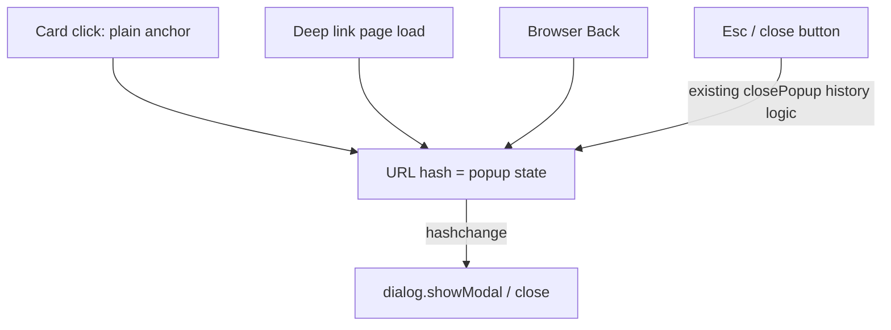
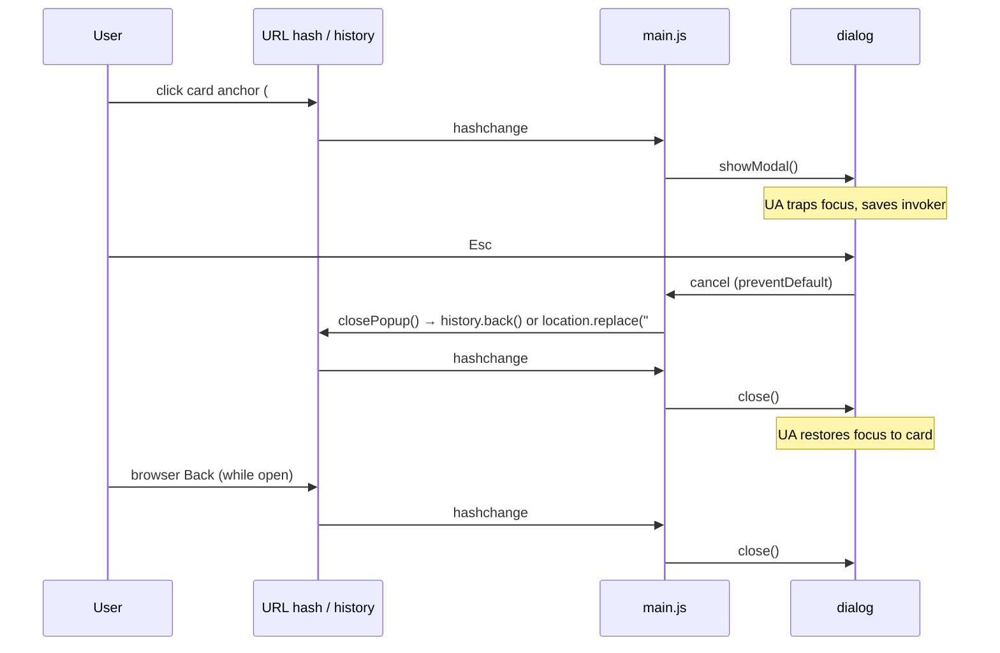

# Native Dialog Popup - Plan

## Goal Capsule

- **Objective:** Replace the CSS `:target` / focus-trap book popup with a native `<dialog>` element, deleting `focus-trap` and `tabbable` (~20 KB of the 23.8 KB `static/main.js`) while keeping Esc, Back, deep links, and focus behavior intact.
- **Product authority:** This document. The zero-JS popup contract is retired by explicit user decision; deep links stay.
- **Stop conditions:** Surface instead of guessing if native dialog behavior contradicts an R-ID in a target browser, or if a change outside `src/render/feed-html.ts`, `ui/`, `static/`, `package.json`, or the renderer test becomes necessary.
- **Open blockers:** None.

---

## Product Contract

_Product Contract preservation: R1–R8 unchanged from the requirements-only version. Dependencies / Assumptions corrected during review: UA focus restore replaced with an explicit restore (Safari/deep-link gap), and the dependency block name fixed to devDependencies._

### Summary

The book detail popup becomes a native modal `<dialog>` driven by the existing URL hash: the renderer emits `<dialog>` markup, CSS presents it via dialog open state instead of `:target`, and `main.js` keeps its hash/history logic while the platform takes over focus trapping, Esc, and focus restore. `focus-trap` and `tabbable` are removed entirely.

### Problem Frame

Two libraries totaling ~20 KB exist solely to trap focus inside one popup — behavior the platform now provides natively via `<dialog>.showModal()`.
The current `:target` mechanism also forces manual work the platform would do for free: hand-rolled Esc handling and manual focus restore to the triggering card.
Prior ideation flagged this exact change as its own spike because it retires the zero-JS popup contract that the renderer test enforces; that retirement is now an accepted decision, unblocking the spike.

### Key Decisions

- **Hash stays the source of truth; the dialog subscribes to it.** Card clicks remain plain `#book-id` anchors; `hashchange` opens or closes the dialog. The existing history logic — entry stamping for deep links, close-without-leaving-the-site — is preserved as-is. The inverted design (dialog-first, manual `pushState`) would rewrite working history code for no gain, since Back-to-close and deep links fall out of the hash for free.
- **JS-only popup.** The `:target` CSS fallback is retired because focus management already required JS — a JS-off visitor was getting a degraded popup anyway. With JS off, the grid and download links keep working; the detail popup does not appear.
- **Deep links stay.** A shared `/folder/#book-id` URL continues to open that book's popup on page load (with JS).
- **Platform replaces libraries one-for-one, no substitutes.** Focus containment, Esc-to-close, and focus restore to the previously focused element all come from native modal dialog behavior; no replacement focus library is introduced.

### Requirements

**Popup behavior**

- R1. The book detail popup opens as a native modal dialog whenever the URL hash addresses a book — via card click or a deep-linked page load.
- R2. The URL hash remains the single source of truth for popup state; dialog state and URL never desync, including when the dialog closes itself (Esc).
- R3. Esc, the close button, and browser Back all close the popup with today's history semantics: closing steps back exactly one entry for card-click opens, and clears the hash in place for deep-link opens (never leaving the folder page).
- R4. Focus parity with today: focus moves into the dialog on open, is contained while open, and returns to the triggering card on close.
- R5. Grid keyboard navigation (arrow/WASD, first-press entry) is unchanged, and nav keys stay suppressed while the popup is open.

**Dependency removal**

- R6. `focus-trap` and `tabbable` are removed from `package.json` devDependencies, from knip's `ignoreDependencies`, and from the bundle; no replacement focus library is added.

**Rendering**

- R7. The renderer emits the book popup as a `<dialog>` element; CSS presents it via dialog open state and `::backdrop` instead of `:target` rules.
- R8. The zero-JS popup contract is retired: with JS disabled, the folder grid, navigation, and download links keep working; the book detail popup requires JS.

### Key Flows

- F1. Open
  - **Trigger:** User clicks a book card, or loads a `/folder/#book-id` deep link.
  - **Steps:** Hash changes (or is present at load); the dialog for that book opens modally; focus lands inside it.
  - **Covered by:** R1, R2, R4
- F2. Close
  - **Trigger:** Esc, close button, or browser Back.
  - **Steps:** All three paths funnel through one close routine; hash clears with the correct history semantics for how the popup was opened; focus returns to the card.
  - **Covered by:** R2, R3, R4

### Acceptance Examples

- AE1. **Covers R1, R2, R4.** Given JS enabled, when the user clicks a book card, then the URL hash becomes that book's id and its modal dialog opens with focus inside.
- AE2. **Covers R3, R4.** Given a popup opened by card click, when the user presses Esc, then the dialog closes, the history steps back one entry (hash gone), and focus returns to the card — identically for the close button and browser Back.
- AE3. **Covers R1, R3.** Given a fresh page load of `/folder/#book-id`, when the user closes the popup, then the hash clears in place without leaving the site and scroll position is preserved.
- AE4. **Covers R8.** Given JS disabled, when a `/folder/#book-id` link is opened, then the grid renders and downloads work, and no popup appears.

### Success Criteria

- `static/main.js` shrinks from 23.8 KB to a few KB after `bun run build:ui`.
- `npx knip` passes with the two dependencies and their ignore entries removed.

### Scope Boundaries

- No visual redesign of the popup — markup and CSS change only as far as the dialog mechanism requires.
- `ui/gridnav/gridnav.ts` is untouched; it has no focus-trap or tabbable dependency.
- The `feed.xml` renderer is untouched.
- No alternate no-JS detail view (plain section or separate page) — considered and rejected in favor of JS-only.

#### Deferred to Follow-Up Work

- A DOM-level test harness (e.g., happy-dom) for `main.ts` popup behavior — no browser test infrastructure exists in the repo today, and `happy-dom` dialog/`showModal` support is unproven; behavior stays manually verified (see Verification Contract).
- Playground popup preview: `ui/playground` injects `renderHtml` output via `innerHTML` and never runs `ui/gridnav/main.ts`, so after this change dialogs cannot open in `bun run dev:ui`. Restoring popup preview means wiring `main.ts` into the playground with re-init on each cassette render — follow-up work; popup behavior is verified against docker meanwhile.

### Dependencies / Assumptions

- Native `<dialog>` with `showModal()` and `::backdrop` is baseline in all target browsers (universal since 2022).
- Native UA focus restore targets the previously _focused_ element, which is not the card for mouse clicks in Safari/macOS Firefox or for deep-link opens (focus sits on `body`). R4 therefore needs a minimal explicit restore on close — focus the `a[href="#<id>"]` anchor for the just-closed dialog (the existing lookup, minus focus-trap).
- The close control stays an `<a class="popup__close-button" href="#">` anchor: the existing click handler already intercepts it, and the CSS gradient styling carries over with zero churn. Converting it to a `<button>` is cosmetic and out of scope.
- Chrome's close-watcher can force-close a modal dialog on a second rapid Esc even when `cancel` is prevented; the `close` event listener re-syncs the hash if that happens, so R2 holds.

### Sources / Research

- `ui/gridnav/main.ts` — the only focus-trap consumer; holds the hash/history logic to preserve (entry stamping, deep-link close, scroll restore).
- `src/render/feed-html.ts` — `renderBook()` emits `
` with `popup__content`, close anchor, meta, and download sections; only the wrapper element changes.
- `ui/styles/index.css` — the popup block: `.popup { display:none; position:fixed; inset:0 }`, `.popup:target { display:block; animation }`, `body:has(.popup:target) { overflow:hidden }`, and a `:target`-scoped close-button hover rule.
- `test/unit/render/feed-html.test.ts` — the only test asserting popup markup and `:target` semantics ("AE3: popup opens/closes with pure links and no JS hooks", "popup→popup" swap test); both get rewritten against dialog markup.
- `docs/ideation/2026-07-14-feed-html-templating-ideation.html` — prior verifier flag: this change "redesigns the zero-JS contract the tests enforce," warranting its own spike (this plan).
- `package.json` — `focus-trap`/`tabbable` in `devDependencies` and in knip `ignoreDependencies`.
- `static/main.js` — 23.8 KB today with both libraries bundled.

---

## Planning Contract

### Key Technical Decisions

- **Esc routes through the dialog's `cancel` event, replacing the document-level keydown listener.** On `cancel`: prevent the default close and call the existing `closePopup()`, so Esc, close button, and Back all converge on the same history path and the hash never desyncs (R2, R3). A `close` listener acts as a safety net: if the dialog closed while the hash still addresses it (Chrome's two-Esc force close), run `closePopup()` to re-sync.
- **`syncPopup()` keeps its name and trigger (hashchange + init) but swaps trap management for dialog management.** On a book hash: close any other open dialog, `showModal()` the target. On no book hash: `close()` the open dialog. The `closing` re-entry flag, `stampEntryPopup()`, and `location.replace("#")` scroll restore survive verbatim.
- **Delete the trap, keep a minimal explicit focus restore.** `createFocusTrap`, `activeTrap`, and the manual `tabindex`/focus dance go away; `showModal()` provides containment (R4). UA focus restore is not sufficient — it targets the previously focused element, which is `body` for Safari/macOS-Firefox mouse clicks and for deep-link opens — so on close, focus the `a[href="#<id>"]` anchor for the just-closed dialog (today's lookup at `ui/gridnav/main.ts:46`, kept without the trap). The document click handler for `.popup__close-button` stays.
- **CSS keys on `dialog[open]`, not `:target`.** `.popup` gets dialog UA-style resets (`border: 0; padding: 0; max-width/max-height: none; width/height` to fill the viewport) replacing `position: fixed; inset: 0; z-index`; `.popup:target` rules become `.popup[open]`; `body:has(.popup:target)` becomes `body:has(.popup[open])` for scroll lock; `::backdrop` stays transparent since the dialog itself is a full-viewport opaque surface.

### High-Level Technical Design

The one asymmetry worth internalizing: Esc does **not** close the dialog directly — it is converted into a history navigation, and the resulting `hashchange` closes the dialog. That keeps R2 (hash never desyncs) with a single close path.

### Assumptions Routed from Planning

- Behavior scenarios (AE1–AE4) are verified manually — the repo has no browser-DOM test harness and adding one is deferred (see Scope Boundaries).
- Initial focus lands on the first focusable element in the dialog (the close anchor) per `showModal()` defaults; this satisfies R4's "focus moves into the dialog" without replicating the old container-focus behavior.

---

## Implementation Units

### U1. Renderer emits dialog markup

- **Goal:** `renderBook()` wraps the popup in `<dialog>` instead of `
`.
- **Requirements:** R7
- **Dependencies:** None.
- **Files:** `src/render/feed-html.ts`, `test/unit/render/feed-html.test.ts`
- **Approach:** Change the popup wrapper in `renderBook()` to `<dialog class="popup" id="${popupId}" aria-labelledby="${popupId}-title">…</dialog>` and give the `h2.popup__title` the matching `id="${popupId}-title"` — `showModal()` grants `role="dialog"` but no accessible name, so the visible title labels the dialog. Everything else inside (`popup__content`, close anchor, meta, downloads) is unchanged. Update the two `:target`-semantics tests to assert dialog markup; leave id-sequencing, escaping, and cassette well-formedness tests intact.
- **Execution note:** Update the renderer tests in the same pass as the markup — the suite gates every commit.
- **Test scenarios:**
  - Covers R7. Rendering a book feed emits `<dialog class="popup" id="book-1">` and the card link `href="#book-1"` (rewrites the "AE3: pure links" test; drop its no-JS framing, keep the no-inline-handlers and no-checkbox assertions).
  - Covers R7. The close control renders inside the dialog as `<a class="popup__close-button" href="#">`.
  - Covers R7. The dialog carries `aria-labelledby="book-1-title"` and its `h2.popup__title` carries the matching `id` — the attribute pair is asserted together.
  - Popup ids stay sequential and unique on `large-folder.xml` (existing test, should pass unmodified).
  - All cassettes still render well-formed markup with `<dialog>` elements (existing XMLValidator loop).
- **Verification:** `bun run test` — renderer suite green with updated assertions.

### U2. CSS presents the popup via dialog state

- **Goal:** Popup visibility, animation, and scroll lock key on `dialog[open]` instead of `:target`.
- **Requirements:** R7
- **Dependencies:** U1
- **Files:** `ui/styles/index.css`
- **Approach:** In the `/* --- Popup --- */` block: reset dialog UA styles on `.popup` (border, padding, `max-width`/`max-height: none`, full-viewport size, keep `background: var(--color-bg)`); drop `display: none` / `position: fixed; inset: 0; z-index` (top layer handles stacking); move the `display` + `popup-fade-in` animation from `.popup:target` to `.popup[open]`; change `body:has(.popup:target)` and the close-button hover scope to `[open]`; leave `::backdrop` unstyled/transparent. Close button stays `position: fixed` — valid in the top layer.
- **Test expectation:** none — CSS presentation with no unit-testable surface; verified visually in U4's walkthrough (AE1–AE3) against docker at `localhost:8080`.
- **Verification:** docker at `localhost:8080` shows the popup opening full-viewport with fade-in; no layout regression versus the current popup. `bun run dev:ui` verifies non-popup layout only — the playground injects markup via `innerHTML` without running `main.ts`, so dialogs never open there (see Scope Boundaries).

### U3. main.ts drives the dialog from the hash

- **Goal:** Hash/history logic drives `showModal()`/`close()`; all focus-trap machinery is deleted.
- **Requirements:** R1, R2, R3, R4, R5
- **Dependencies:** U1
- **Files:** `ui/gridnav/main.ts`
- **Approach:** Per the Key Technical Decisions: `syncPopup()` swaps trap management for dialog open/close; the `cancel` listener (per dialog, attached at init or on open — `cancel` does not bubble) converts Esc into `closePopup()`; a `close` listener re-syncs the hash on force-close; on close, restore focus explicitly to the just-closed dialog's `a[href="#<id>"]` card anchor (UA restore alone misses Safari/macOS-Firefox mouse opens and deep-link opens); delete `createFocusTrap` imports, `activeTrap`, the manual tabindex handling, and the document-level Escape keydown listener. `popupIsOpen()`, `stampEntryPopup()`, `closePopup()`, the `closing` flag, the close-button click handler, and all Gridnav wiring stay as-is.
- **Test scenarios:** manual — no browser test harness in the repo (deferred, see Scope Boundaries). Walkthrough against docker at `localhost:8080` (the playground cannot open dialogs — it injects markup without running `main.ts`); run in Chrome plus Safari or Firefox (focus-restore behavior differs):
  - Covers AE1 / F1. Click a card: hash set, dialog opens modally, focus inside, background inert (Tab cycles within the dialog).
  - Covers AE2 / F2. Esc, close button, and Back each close the dialog, remove the hash in one history step, and return focus to the card.
  - Covers AE3. Deep-link load `/folder/#book-N`, then close: hash clears in place, site not left, scroll preserved.
  - Covers R2. Double-Esc pressed rapidly: no double `history.back()` (the `closing` flag), and if the browser force-closes the dialog, the hash re-syncs via the `close` listener.
  - Covers R5. Arrow/WASD grid navigation works before opening and after closing; nav keys do nothing while the dialog is open.
  - Forward/back between two book hashes (`#book-1` → `#book-2` via history): first dialog closes, second opens.
- **Verification:** All six walkthrough scenarios pass in a browser; `bun --bun tsc --noEmit` clean.

### U4. Remove dependencies, regenerate artifacts, full gate

- **Goal:** `focus-trap`/`tabbable` fully gone; committed `static/` artifacts reflect the new build; all repo gates green.
- **Requirements:** R6, R8, Success Criteria
- **Dependencies:** U1, U2, U3
- **Files:** `package.json`, `bun.lock`, `static/main.js`, `static/style.css`
- **Approach:** Remove both packages from `devDependencies` and from the knip `ignoreDependencies` block; `bun install`; `bun run build:ui` to regenerate `static/main.js` + `static/style.css`.
- **Test scenarios:**
  - Covers R6. `npx knip` passes with no ignore entries for the removed packages.
  - Covers Success Criteria. `static/main.js` is a few KB (was 23.8 KB).
  - Covers AE4 / R8. With JS disabled in the browser, a `/folder/#book-N` load shows the working grid and download links, and no popup.
  - `bun run test:all` passes, including the `build:ui:check` freshness gate (`git diff --exit-code static/`).
- **Verification:** `bun run fix` (0 warnings), `bun run test:all` green, knip clean, size criterion met.

---

## Verification Contract

| Gate                   | Command                                           | Proves                                                                        |
| ---------------------- | ------------------------------------------------- | ----------------------------------------------------------------------------- |
| Lint/format            | `bun run fix`                                     | Zero warnings, zero errors policy                                             |
| Types                  | `bun --bun tsc --noEmit`                          | main.ts rewrite typechecks                                                    |
| Unit + integration     | `bun run test` (docker)                           | Renderer emits dialog markup (U1)                                             |
| Unused deps            | `npx knip`                                        | R6 — clean removal                                                            |
| Full suite + freshness | `bun run test:all`                                | `static/` artifacts match sources                                             |
| Behavior walkthrough   | docker `localhost:8080` (Chrome + Safari/Firefox) | AE1–AE4, R2–R5 manual scenarios (U3, U4); dev:ui covers non-popup layout only |

Flaky-test note: unit/e2e suites have known flakes — re-run once before investigating a failure.

## Definition of Done

- All four units complete; R1–R8 each verified by a passing test or an executed walkthrough scenario.
- `static/main.js` regenerated at a few KB; `static/style.css` regenerated; freshness gate passes.
- `focus-trap` and `tabbable` absent from `package.json`, `bun.lock`, and knip config.
- All Verification Contract gates green; no abandoned experimental code left in the diff.
- No commit until explicitly requested.
